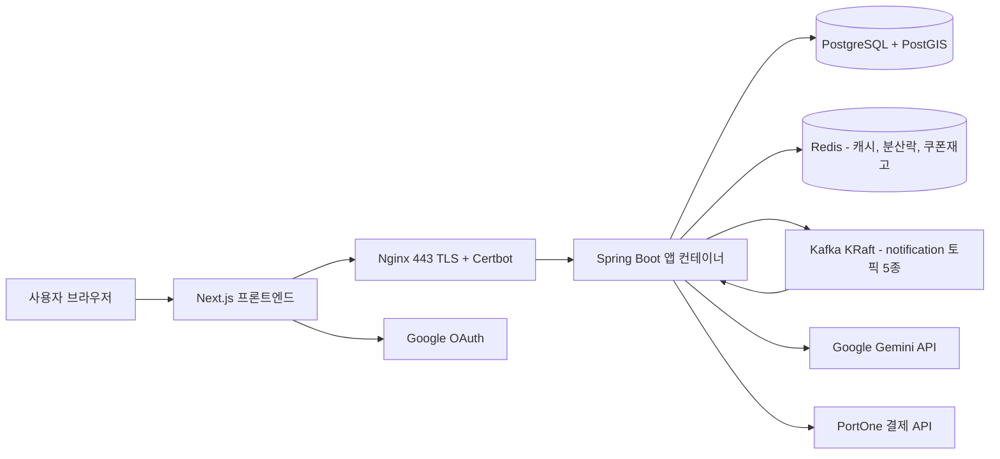
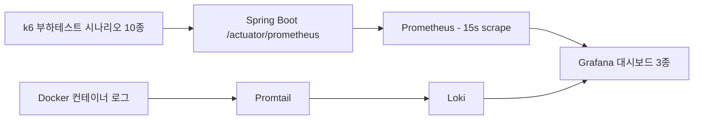

캐치테이블을 참고한 레스토랑 예약 플랫폼입니다. 기능 구현보다 **실제 요청 흐름에서 병목과 장애 전파를 찾아 개선하는 것**에 초점을 둔 백엔드 고도화 프로젝트로, k6 부하 테스트와 Prometheus/Grafana/Loki 모니터링을 붙여 개선 효과를 측정했습니다.

## 개요

| 항목 | 내용 |
|---|---|
| 기간 | 2026.04 ~ 2026.06 |
| 역할 | 백엔드 개발 (일부 프론트엔드 연동) |
| 팀 구성 | 4명 |
| 배포 | EC2 + Nginx(TLS) — `api.catcheat.kro.kr` |
| 저장소 | [catchtable-clone/backend](https://github.com/catchtable-clone/backend) · [frontend](https://github.com/catchtable-clone/frontend) |

**기술 스택**

| 영역 | 사용 기술 |
|---|---|
| Backend | Java 21, Spring Boot 4.0, Spring Data JPA (Hibernate Spatial), Spring Security + JJWT |
| 비동기·동시성 | Spring Kafka, Spring Data Redis + Redisson, Resilience4j |
| AI | Spring AI (Google GenAI, gemini-2.5-flash) |
| DB | PostgreSQL + PostGIS |
| 인프라 | Docker Compose, Nginx + Certbot, Kafka (KRaft), Redis 7 |
| 관측 | Prometheus, Grafana, Loki, Promtail, Micrometer |
| 부하 테스트 | k6 |
| Frontend | Next.js 16, React 19, TypeScript, TanStack Query, Zustand, Tailwind CSS |

## 아키텍처



### 관측 구성



Grafana 대시보드는 백엔드 모니터링 / 운영 모니터링 / 부하 테스트 전용 3종을 프로비저닝으로 관리합니다.

## 데이터 모델

```mermaid
erDiagram
    users ||--o{ reservations : "예약한다"
    users ||--o{ reviews : "작성한다"
    users ||--o{ coupons : "보유한다"
    users ||--o{ bookmark_folders : "소유한다"
    stores ||--o{ store_remain : "잔여석을 가진다"
    stores ||--o{ reviews : "리뷰가 달린다"
    stores ||--o{ bookmarks : "저장된다"
    store_remain ||--o{ reservations : "슬롯이 예약된다"
    reservations ||--|| payments : "보증금 결제"
    reservations ||--o| reviews : "리뷰 1건"
    coupon_templates ||--o{ coupons : "발급된다"
    coupons ||--o{ reservations : "할인 적용"
    bookmark_folders ||--o{ bookmarks : "담는다"

    users {
        bigint id PK
        string email UK
        string nickname UK
        string google_id UK
        enum role
        int noshow_count
        datetime noshow_restricted_until
    }
    stores {
        bigint id PK
        string store_name
        enum category
        enum district
        double latitude
        double longitude
        geography location "PostGIS Point 4326"
        double average_star
        int review_count
        int bookmark_count
    }
    store_remain {
        bigint id PK
        bigint store_id FK
        date remain_date
        time remain_time
        int remain_team
        bigint version "낙관적 락"
    }
    reservations {
        bigint id PK
        bigint user_id FK
        bigint remain_id FK
        bigint coupon_id FK
        int member
        enum status
        boolean reminded
    }
    payments {
        bigint id PK
        bigint reservation_id FK
        string order_id UK
        int amount
        string portone_payment_id
        enum status
    }
    coupon_templates {
        bigint id PK
        string coupon_name
        int discount_rate
        int remain
        datetime started_at
        datetime expired_at
    }
    coupons {
        bigint id PK
        bigint user_id FK
        bigint coupon_template_id FK
        enum status
        datetime used_at
    }
    reviews {
        bigint id PK
        bigint user_id FK
        bigint store_id FK
        bigint reservation_id FK "UNIQUE"
        int star
    }
```

핵심 제약 조건 세 가지로 도메인 규칙을 DB 레벨에서 강제했습니다.

- `coupons`의 `UNIQUE(user_id, coupon_template_id)` — 1인 1매 발급 보장
- `reviews.reservation_id`의 `unique = true` — 예약 1건당 리뷰 1건
- `store_remain.version` — JPA `@Version` 낙관적 락

가독성을 위해 `menu`, `notifications`, `vacancy_subscriptions`, `chat_sessions`, `chat_messages`, `refresh_token`은 위 다이어그램에서 생략했습니다.

## 주요 기능

| 도메인 | 기능 |
|---|---|
| 인증 | 구글 소셜 로그인(JWT 발급), 토큰 재발급, 로그아웃 |
| 매장 | 등록·수정·상태변경, 목록(카테고리/지역 필터), 인기 매장, 내 주변 매장, 지도 영역 조회 |
| 예약 | 예약 생성(분산 락 + 낙관적 락), 조회·취소·변경·방문 처리 |
| 결제 | PortOne 카카오페이 보증금 결제 확인·검증·환불 |
| 쿠폰 | 템플릿 생성, 선착순 발급(Redis Lua 원자 처리), 보유 쿠폰 조회 |
| 빈자리 | 마감 슬롯 구독 → 취소 발생 시 알림 |
| 알림 | Kafka 컨슈머 기반 인앱 알림 (예약 확정/취소/변경/방문/빈자리 5개 토픽) |
| 챗봇 | Gemini 기반 대화형 예약 — 매장 검색·시간대 조회·쿠폰 확인·예약 생성/취소를 Tool Calling으로 수행 |

Spring AI `@Tool`로 노출한 함수는 8개입니다 — `searchStoresByName`, `createReservationFromAi`, `getMyReservationsForAi`, `getCanceledReservationsForAi`, `cancelReservationFromAi`, `getAvailableCouponsForAi`, `getAvailableTimeSlotsForAi`, `getNearbyPopularStoresForAi`.

## 기술적으로 해결한 문제

### 1. 지도·주변 매장 조회가 부하 상황에서 SLA를 크게 초과

**문제**

매장 118,725건 기준 반경 검색에서 전체 데이터를 순차 스캔하는 구조라 **P95 12,587ms**가 측정됐습니다. k6 부하 시나리오에서도 지리 쿼리 두 개가 SLA(p95 2초)를 크게 넘겼습니다.

| API | 50VU p95 |
|---|---|
| `GET /stores/nearby` | 10.33초 |
| `GET /stores/in-bounds` | 8.36초 |

**원인 분석**

기존 쿼리는 `ST_DistanceSphere(ST_MakePoint(...), ST_MakePoint(...))`를 `WHERE`/`ORDER BY`에서 전체 행에 대해 계산하는 구조였습니다. **함수 호출 결과에는 인덱스를 쓸 수 없어** 매 요청마다 전 매장 전수 스캔 + 전수 거리 계산이 일어납니다.

k6 스크립트에 "타임아웃 발생 → GIST 공간 인덱스 미적용 의심"이라는 가설을 세우고, 인덱스 적용 여부를 진단하는 `handleSummary` 리포트를 붙여 재측정하는 방식으로 원인을 좁혔습니다.

**해결**

3단계로 나눠 적용했습니다.

**1단계 — 인덱스가 타는 형태로 스키마 변경.** `ddl-auto`는 공간 타입과 GIST를 생성하지 못하므로 마이그레이션 스크립트를 유일한 생성 경로로 뒀습니다.

```sql
ALTER TABLE stores ADD COLUMN IF NOT EXISTS location geography(Point, 4326);
UPDATE stores SET location = ST_SetSRID(ST_MakePoint(longitude, latitude), 4326)::geography
WHERE location IS NULL AND latitude IS NOT NULL AND longitude IS NOT NULL;
CREATE INDEX IF NOT EXISTS idx_stores_location_gist ON stores USING GIST (location);
```

**2단계 — 쿼리를 `ST_DWithin`(GIST 필터) + KNN 연산자(`<->`) 정렬로 교체.**

```sql
SELECT * FROM stores s
WHERE s.is_deleted = false
  AND ST_DWithin(s.location, ST_SetSRID(ST_MakePoint(:lon, :lat), 4326)::geography, :radiusMeters)
ORDER BY s.location <-> ST_SetSRID(ST_MakePoint(:lon, :lat), 4326)::geography ASC, s.id ASC
```

**3단계 — 검색 반경 조정.** GIST 인덱스를 붙였는데도 플래너가 Seq Scan을 고르는 구간이 남았습니다. 반경 5km 안에 전체 매장의 56%가 들어와 **인덱스 스캔이 오히려 손해**라고 판단된 것이라, 반경을 줄여 매칭 행 수를 낮췄습니다(5000m → 1000m, 이후 3000m로 재조정).

**결과**

| 항목 | 개선 전 | 개선 후 |
|---|---|---|
| 거리 계산 방식 | 전 행 `ST_DistanceSphere` 전수 계산 | GIST 인덱스 `ST_DWithin` 필터 + KNN 정렬 |
| 반경 검색 P95 (118,725건) | 12,587ms | **245ms** |
| SLA 기준 | — | p95 < 2,000ms (k6 thresholds) |

### 2. AI 챗봇 장애가 서비스 전체로 번지고, 타임아웃이 중복 예약을 만들던 문제

**문제**

챗봇은 외부 Gemini API에 의존하는데, 예약 흐름이 `searchStoresByName → getAvailableCouponsForAi → createReservationFromAi`로 함수 호출이 연쇄돼 응답이 깁니다. 세 가지 문제가 겹쳤습니다.

1. 이 호출이 공용 `ForkJoinPool`을 점유해 다른 비동기 작업까지 밀어냄
2. 타임아웃 후 재시도하면 **이미 만들어진 예약 위에 예약이 하나 더 생김**
3. 외부 API 장애 시 요청이 계속 쌓임

**원인 분석**

Resilience4j를 1차 적용한 뒤에도 재시도가 동작하지 않는 것을 확인했는데, 원인은 **데코레이터 적용 순서와 예외 소실**이었습니다. 내부에서 예외를 일일이 폴백 문자열로 바꿔버리면 Retry가 실패로 인식할 예외 자체가 사라집니다.

또 Tool 함수가 `aiExecutor` 워커 스레드에서 실행되는데 결제 대기 정보를 `ThreadLocal`로 주고받고 있어, 요청 스레드에서는 값을 읽을 수 없고 워커 스레드에는 값이 누적됐습니다.

**해결**

데코레이터를 `Bulkhead → Retry → CircuitBreaker → 실제 호출(타임아웃)` 순으로 중첩하고, **타임아웃은 재시도 대상에서 제외**했습니다.

```java
// ChatbotService.callAi — 적용 순서가 곧 격리 정책
return aiBulkhead.executeSupplier(() ->
        aiRetry.executeSupplier(() ->
                aiCircuitBreaker.executeSupplier(() ->
                        executeAiCallWithTimeout(messages, context))));

// 타임아웃은 CustomException 으로 던져 Retry 의 ignore-exceptions 에 걸린다.
// 이 시점엔 createReservationFromAi 가 이미 예약을 만들었을 수 있어, 재시도하면 예약이 두 건 된다.
} catch (TimeoutException e) {
    future.cancel(true);
    throw new CustomException(ErrorCode.CHAT_AI_TIMEOUT);
}
```

함께 적용한 것:

- **AI 전용 고정 스레드풀(20) 분리** — 공용 `ForkJoinPool` 오염 차단. Bulkhead `max-concurrent-calls`와 같은 크기로 맞춰 큐 대기 없이 즉시 거부되도록 함
- `ThreadLocal` 값을 `AiCallResult` 레코드에 실어 반환하고, `finally`에서 워커 스레드 기준으로 `clear()`
- 예외 유형별(타임아웃 / 429 / 인증 / 회로 OPEN / Bulkhead 초과) 사용자 메시지 폴백 — 실패해도 5xx 대신 안내 문구 반환
- 타임아웃으로 남겨진 미결제 예약은 `PENDING` 상태로 두고 정리 스케줄러가 만료 처리
- 예약 생성 자체에 **멱등성 가드** 추가 — 같은 사용자·같은 슬롯에 좁은 시점 예약이 있으면 새로 만들지 않음

**결과**

| 항목 | 개선 전 | 개선 후 |
|---|---|---|
| AI 호출 스레드 | 공용 `ForkJoinPool` | 전용 고정 풀 20개 |
| 동시 호출 제한 | 없음 | Bulkhead 20, 대기 0ms (초과 시 즉시 거부) |
| 타임아웃 | 10초, 재시도됨 | 30초, 재시도 제외 (`ignore-exceptions`) |
| 타임아웃 시 예약 | 재시도로 중복 생성 가능 | 멱등성 가드 + `PENDING` 정리 스케줄러 |
| 외부 API 장애 시 | 요청 누적 | 실패율 50%·10회 윈도우로 회로 OPEN, 30초 후 HALF-OPEN 3회 시험 |
| 사용자 응답 | 예외 전파 | 오류 유형별 안내 문구 폴백 |

### 3. 지도 마커가 화면 중앙에만 원형으로 뭉치던 문제

**문제**

지도 영역 조회는 `limit`으로 잘라내는데, 정렬 기준이 화면 중심 거리순이라 자를수록 중심에 가까운 매장만 남았습니다. 결과적으로 화면 전체에 매장이 흩어져 있어도 마커는 가운데 원형으로만 표시됐습니다.

**원인 분석**

`ORDER BY 거리 ASC LIMIT n`은 "화면에서 고르게 뽑기"가 아니라 "중심에서 가까운 n개 뽑기"입니다. **자르는 축과 보여줘야 할 분포가 어긋난 것**이 원인이라, 자르기 전에 공간적으로 솎아내는 단계가 필요했습니다.

**해결**

화면을 격자로 나눠 칸마다 대표 매장 1건만 남기는 방식으로 바꿨습니다. PostGIS `ST_SnapToGrid`로 좌표를 격자 원점에 스냅하고 `DISTINCT ON`으로 셀 대표를 뽑습니다.

```sql
WITH in_bounds AS (
    SELECT s.id, s.latitude, s.longitude, s.average_star, s.review_count,
           ST_SnapToGrid(s.location::geometry, :cellX, :cellY) AS grid_cell
    FROM stores s
    WHERE s.is_deleted = false
      AND s.location && ST_MakeEnvelope(:minLng, :minLat, :maxLng, :maxLat, 4326)::geography
),
picked AS (
    SELECT DISTINCT ON (grid_cell) latitude, longitude
    FROM in_bounds
    ORDER BY grid_cell, average_star DESC, review_count DESC, id ASC
)
SELECT s.* FROM stores s JOIN picked p ON s.latitude = p.latitude AND s.longitude = p.longitude
```

셀 크기는 화면 bounds를 `GRID_DIVISIONS`로 나눠 화면 비율에 맞게 축별로 계산하고, 0이 되면 `ST_SnapToGrid`가 실패하므로 하한을 뒀습니다. 영역 필터는 `&&` 연산자를 써서 GIST 인덱스를 타게 했습니다.

**결과**

| 항목 | 개선 전 | 개선 후 |
|---|---|---|
| 자르기 기준 | 중심 거리순 `LIMIT` | 격자 셀당 대표 1건 샘플링 후 `LIMIT` |
| 마커 분포 | 화면 중앙 집중 | 화면 전역에 균등 |
| 줌인 동작 | 이미 알려진 매장이 계속 선점 | 영역이 좁아지며 격자도 촘촘해져 새 매장이 드러남 |
| 영역 필터 | `ST_DistanceSphere` 전수 계산 | `&&` + `ST_MakeEnvelope` (GIST 인덱스) |

### 4. 매 요청마다 DB 집계가 도는 매장 목록·인기 매장 조회

**문제**

인기 매장(`/stores/popular`)과 매장 목록(`/stores`)은 변경 빈도가 낮은데도 요청마다 정렬·집계 쿼리를 그대로 DB에 보냈습니다. 부하 테스트에서 이 구간이 DB 커넥션 포화를 부르는 지점이었습니다.

**원인 분석**

전체 사용자 플로우 시나리오에 Step별 p95를 기록하고 가장 큰 값을 "병목 1순위"로 출력하는 `handleSummary`를 붙여, 플로우 중 어느 단계가 먼저 무너지는지 순서를 확인했습니다. 동시에 Grafana 부하 테스트 대시보드에 HikariCP 커넥션 활성·대기시간 패널을 두고 커넥션 압력을 함께 봤습니다.

**해결**

Redis 캐시 매니저를 도입하고 조회 메서드에 TTL을 나눠 걸었습니다. 캐시 무효화는 매장 생성·수정·상태변경·리뷰 통계 갱신 경로에 모두 붙였습니다.

```java
@Cacheable(value = "storeList",
           key = "(#category?.name() ?: 'ALL') + ':' + (#district?.name() ?: 'ALL') + ':' + #page + ':' + #size",
           condition = "#name == null || #name.isBlank()")   // 검색어 있는 요청은 캐싱하지 않음
public List<StoreListResponse> getStores(...)

@Cacheable(value = "popularStores", key = "#limit")
public List<StoreListResponse> getPopularStores(int limit)

@CacheEvict(value = {"popularStores", "storeList"}, allEntries = true)
public StoreResponse updateStore(...)
```

함께 적용한 것:

- **인기순 정렬 전용 복합 인덱스** `idx_store_popularity (is_deleted, average_star DESC, review_count DESC, bookmark_count DESC, id ASC)` — 정렬 순서를 인덱스에서 그대로 받음
- **N+1 제거** — 챗봇 예약 조회의 `PENDING` orderId 조회를 건별 → `IN` 쿼리 1회로, 매장명 조회를 전체 로드 후 메모리 필터 → DB 조회로 교체
- 메뉴 생성 일괄 처리 + `hibernate.jdbc.batch_size: 50`, `order_inserts/order_updates: true`
- 북마크 폴더 삭제 시 `forEach` N번 UPDATE → 벌크 UPDATE 1번
- 리뷰 조회 전체 로드 → 최근 20건 페이징, page size 상한 100
- HikariCP 풀 10 → 30, `connection-timeout` 3초, JPA `open-in-view: false`

**결과**

| 항목 | 개선 전 | 개선 후 |
|---|---|---|
| 인기 매장 조회 | 요청마다 DB 집계 | Redis 캐시 TTL 5분 |
| 매장 목록 조회 | 요청마다 DB 조회 | Redis 캐시 TTL 10분 (검색어 요청 제외) |
| 인기순 정렬 | 전용 인덱스 없음 | `idx_store_popularity` 복합 인덱스 |
| DB 커넥션 풀 | max 10, OSIV on | max 30, `open-in-view: false`, timeout 3초 |
| 리뷰 조회 | 전체 로드 | 최근 20건 페이징 |

## 담당 범위

4명 팀에서 백엔드 개발을 담당했습니다.

**설계·구현**

| 영역 | 내용 |
|---|---|
| 인증 | Spring Security + JWT 구조 설계, 구글 소셜 로그인 백엔드·프론트 연동, `X-User-Id` 헤더 방식 → `@AuthenticationPrincipal` 전환 |
| 결제 | PortOne 카카오페이 결제 플로우(결제창 호출 + 백엔드 검증/환불), 예약 취소·변경 시 결제 상태 연동 |
| 챗봇 | Gemini 기반 기능 확장, 시스템 프롬프트 가드레일 6항목(역할 고정 / 범위 제한 / 프롬프트 보호 / 타인 정보 보호 / 역할극 거부 / 개인정보 수집 금지), Resilience4j 고도화, 챗봇 UI 및 예약 결제 버튼 |
| 기본 도메인 | 메뉴 CRUD, 북마크·폴더 CRUD, Swagger 문서 설정 |

**성능·품질**

| 영역 | 내용 |
|---|---|
| 부하 테스트 | k6 시나리오 10종 작성(event_spike / ramp_up / soak), 시나리오별 `handleSummary` 진단 리포트 |
| 관측 | Grafana 부하 테스트 대시보드 및 운영 모니터링 대시보드 |
| 공간 검색 | PostGIS geography 컬럼 + GIST 인덱스 마이그레이션, `ST_DWithin` + KNN 전환, Seq Scan 회피 반경 조정 |
| 캐싱·쿼리 | 매장 목록·인기 매장 Redis 캐시, 복합 인덱스, N+1 제거, 벌크 UPDATE, 페이징 |
| 안정성 | 부하 테스트 중 OOM 방지를 위한 컨테이너 메모리 한도 조정 |

선착순 쿠폰의 Redis Lua 원자 처리와 재고 동기화 스케줄러, 예약 도메인 핵심 로직과 알림 도메인, 빈자리 구독·알림과 잔여석 도메인은 다른 팀원이 담당했습니다.

## 배운 점

**인덱스를 "추가"하는 것과 "타게 만드는" 것은 다른 일이다.** GIST 인덱스를 만들어 놓고도 플래너가 Seq Scan을 골랐습니다. 반경 5km 안에 전체 매장의 56%가 들어오면 인덱스 스캔이 오히려 손해라는 판단이었습니다. 인덱스는 선언이 아니라 데이터 분포와 쿼리 선택도(selectivity)가 맞물릴 때 비로소 효과가 난다는 걸 실행 계획을 보며 배웠습니다.

**부하 테스트는 숫자를 뽑는 도구가 아니라 가설을 검증하는 도구다.** 처음에는 p95만 쳐다봤는데, 그 숫자만으로는 "느리다"밖에 알 수 없었습니다. 시나리오마다 `handleSummary`에 "타임아웃이 발생하면 GIST 인덱스 미적용 의심", "Step별 p95 중 최댓값이 병목 1순위" 같은 판정 로직을 넣고 나서야 테스트 실행 한 번이 곧 진단 한 번이 됐습니다.

**장애 격리는 애노테이션을 붙이는 게 아니라 실패 경로를 설계하는 일이다.** Resilience4j를 처음 적용했을 때 Retry가 동작하지 않았는데, 원인은 설정이 아니라 내부에서 예외를 일일이 폴백 문자열로 바꿔버린 코드였습니다. **재시도할 예외와 재시도하면 안 되는 예외(타임아웃 — 부수효과가 이미 일어났을 수 있음)를 구분**하고 나서야 정책이 의도대로 돌았습니다.

**동시성 문제는 스레드 경계를 눈으로 그려봐야 보인다.** Tool 함수가 전용 스레드풀 워커에서 실행되는데 결제 정보를 `ThreadLocal`로 주고받고 있었습니다. "어느 스레드에서 쓰고 어느 스레드에서 읽는가"를 그려보기 전까지는 값이 왜 비는지, 왜 워커에 누적되는지 알 수 없었습니다.

**측정값은 그때 남겨야 한다.** 개선 전 수치는 k6 스크립트 주석에 적어둔 덕분에 남았지만, 개선 후 수치는 결과 파일을 커밋하지 않아 재현이 어려웠습니다. 성능 작업은 before/after를 파일로 커밋하는 것까지가 한 세트라는 걸 이 문서를 쓰면서 체감했습니다.
