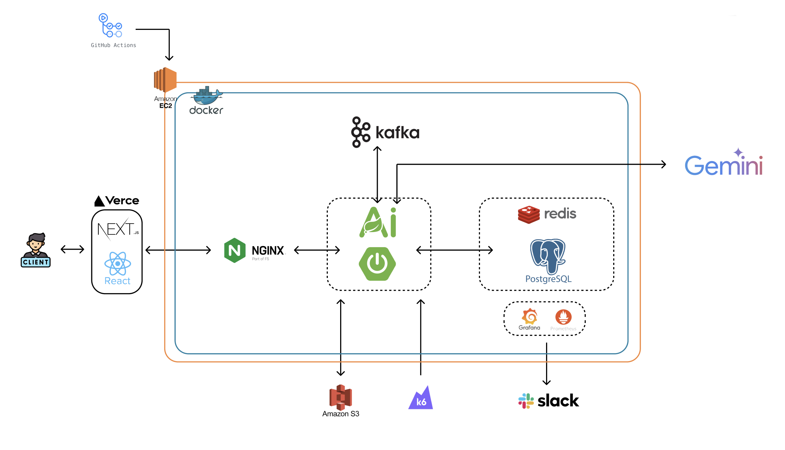
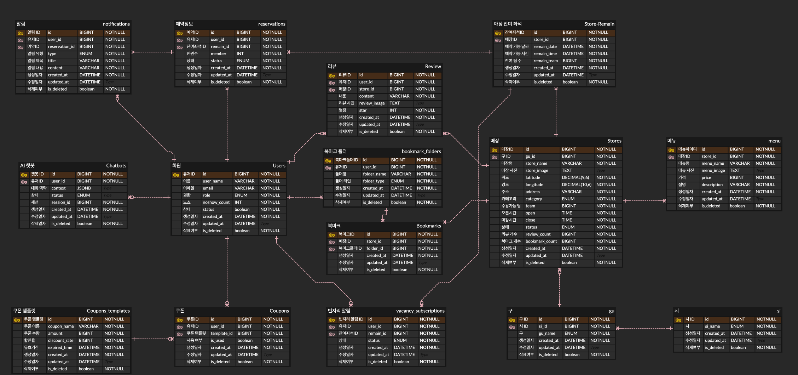

캐치테이블을 참고한 레스토랑 예약 플랫폼입니다.

기능 구현보다 **실제 요청 흐름에서 병목과 장애 전파를 찾아 개선하는 것**에 초점을 둔 백엔드 고도화 프로젝트로, k6 부하 테스트와 Prometheus/Grafana/Loki 모니터링을 붙여 개선 효과를 측정했습니다.

## 개요

| 항목 | 내용 |
|---|---|
| 기간 | 2026.04 ~ 2026.06 |
| 역할 | 백엔드 개발 (일부 프론트엔드 연동) |
| 팀 구성 | 4명 |
| 배포 | EC2 + Docker Compose + Nginx (TLS) |

**프로젝트 기술 스택**

| 영역 | 사용 기술 |
|---|---|
| Backend | Java 21, Spring Boot 4.0, Spring Data JPA (Hibernate Spatial), Spring Security + JJWT |
| 비동기·동시성 | Spring Kafka, Spring Data Redis + Redisson, Resilience4j |
| AI | Spring AI (Google GenAI, gemini-2.5-flash) |
| DB | PostgreSQL + PostGIS |
| 인프라 | Docker Compose, Nginx + Certbot, Kafka (KRaft), Redis 7 |
| 관측 | Prometheus, Grafana, Loki, Promtail, Micrometer |
| 부하 테스트 | k6 |
| Frontend | Next.js 16, React 19, TypeScript, TanStack Query, Zustand, Tailwind CSS |

## 시스템 아키텍처



Grafana 대시보드는 백엔드 모니터링 / 운영 모니터링 / 부하 테스트 전용 3종을 프로비저닝으로 관리합니다.

## 데이터 모델



핵심 제약 조건 세 가지로 도메인 규칙을 DB 레벨에서 강제했습니다.

- `coupons`의 `UNIQUE(user_id, coupon_template_id)` — 1인 1매 발급 보장
- `reviews.reservation_id`의 `unique = true` — 예약 1건당 리뷰 1건
- `store_remain.version` — JPA `@Version` 낙관적 락

## 주요 기능

| 도메인 | 기능 |
|---|---|
| 인증 | 구글 소셜 로그인(JWT 발급), 토큰 재발급, 로그아웃 |
| 매장 | 등록·수정·상태변경, 목록(카테고리/지역 필터), 인기 매장, 내 주변 매장, 지도 영역 조회 |
| 예약 | 예약 생성(분산 락 + 낙관적 락), 조회·취소·변경·방문 처리 |
| 결제 | PortOne 카카오페이 보증금 결제 확인·검증·환불 |
| 쿠폰 | 템플릿 생성, 선착순 발급(Redis Lua 원자 처리), 보유 쿠폰 조회 |
| 빈자리 | 마감 슬롯 구독 → 취소 발생 시 알림 |
| 알림 | Kafka 컨슈머 기반 인앱 알림 (5개 토픽) |
| 챗봇 | Gemini 기반 대화형 예약 — 매장 검색·시간대 조회·쿠폰 확인·예약 생성/취소를 Tool Calling으로 수행 |

Spring AI `@Tool`로 노출한 함수는 8개입니다 — `searchStoresByName`, `createReservationFromAi`, `getMyReservationsForAi`, `getCanceledReservationsForAi`, `cancelReservationFromAi`, `getAvailableCouponsForAi`, `getAvailableTimeSlotsForAi`, `getNearbyPopularStoresForAi`.

## 기술적으로 해결한 문제

### 1. 위치 기반 매장 검색 성능 개선

매장 118,725건 기준 반경 검색이 전체 테이블을 순차 스캔해 **P95 12,587ms**였습니다. `ST_DistanceSphere`를 `WHERE`/`ORDER BY`에서 전 행에 계산하는 구조라 **함수 호출 결과에는 인덱스가 걸리지 않았습니다.** PostGIS `geography` 컬럼과 GIST 인덱스를 추가하고 `ST_DWithin`(범위 필터) + KNN 연산자(`<->`) 정렬로 교체 — **RDB 내장 공간 연산을 쓰면 별도 검색 엔진 없이 정확도와 성능을 함께 확보할 수 있다고 판단**했습니다.

인덱스를 붙이고도 플래너가 Seq Scan을 고르는 구간이 남았습니다. 반경 5km 안에 전체 매장의 56%가 들어와 **인덱스 스캔이 오히려 손해**라고 판단된 것이라, 검색 반경을 줄여 매칭 행 수를 낮췄습니다(5km → 1km, 이후 3km로 재조정).

<div class="perf">
<div class="perf-hero">
  <div class="perf-hero__item">
    <span class="perf-hero__label">개선 전 P95</span>
    <span class="perf-hero__value perf-hero__value--before">12,587<span class="perf-hero__unit">ms</span></span>
  </div>
  <div class="perf-hero__arrow" aria-hidden="true">&rarr;</div>
  <div class="perf-hero__item">
    <span class="perf-hero__label">개선 후 P95</span>
    <span class="perf-hero__value perf-hero__value--after">245<span class="perf-hero__unit">ms</span></span>
  </div>
  <div class="perf-hero__delta">51&times; 빠름</div>
</div>
<p class="perf-caption">매장 118,725건 기준 반경 검색 p95 응답시간.</p>
</div>

<details>
<summary>k6 부하 테스트 결과와 적용한 마이그레이션·쿼리</summary>

k6 50VU 시나리오에서도 지리 쿼리 두 개가 목표치(p95 2초)를 4~5배 넘겼습니다. "타임아웃 발생 → GIST 인덱스 미적용 의심"이라는 가설과 인덱스 적용 여부를 판정하는 `handleSummary` 리포트를 스크립트에 붙여 원인을 좁혔습니다.

<div class="perf">
<div class="perf-chart">
<svg viewBox="0 0 640 168" role="img" aria-label="50VU 부하에서 nearby 10.33초, in-bounds 8.36초로 SLA 2초를 크게 초과">
  <line class="perf-axis" x1="168" y1="30" x2="168" y2="126" />
  <line class="perf-threshold" x1="247" y1="24" x2="247" y2="132" />
  <text class="perf-note" x="251" y="20">SLA p95 2초</text>
  <text class="perf-cat" x="160" y="60" text-anchor="end">/stores/nearby</text>
  <path class="perf-bar" d="M168,44 H 570 a4,4 0 0 1 4,4 V 68 a4,4 0 0 1 -4,4 H 168 Z" />
  <text class="perf-val" x="584" y="63">10.33초</text>
  <text class="perf-cat" x="160" y="110" text-anchor="end">/stores/in-bounds</text>
  <path class="perf-bar" d="M168,94 H 492 a4,4 0 0 1 4,4 V 118 a4,4 0 0 1 -4,4 H 168 Z" />
  <text class="perf-val" x="506" y="113">8.36초</text>
  <line class="perf-axis" x1="168" y1="132" x2="600" y2="132" />
  <text class="perf-note" x="168" y="150">0</text>
  <text class="perf-note" x="590" y="150" text-anchor="end">11초</text>
</svg>
</div>
</div>

`ddl-auto`는 공간 타입과 GIST를 생성하지 못하므로 마이그레이션 스크립트를 유일한 생성 경로로 뒀습니다.

```sql
ALTER TABLE stores ADD COLUMN IF NOT EXISTS location geography(Point, 4326);
UPDATE stores SET location = ST_SetSRID(ST_MakePoint(longitude, latitude), 4326)::geography
WHERE location IS NULL AND latitude IS NOT NULL AND longitude IS NOT NULL;
CREATE INDEX IF NOT EXISTS idx_stores_location_gist ON stores USING GIST (location);
```

```sql
SELECT * FROM stores s
WHERE s.is_deleted = false
  AND ST_DWithin(s.location, ST_SetSRID(ST_MakePoint(:lon, :lat), 4326)::geography, :radiusMeters)
ORDER BY s.location <-> ST_SetSRID(ST_MakePoint(:lon, :lat), 4326)::geography ASC, s.id ASC
```

</details>

### 2. AI 챗봇 장애 격리와 중복 예약 방지

챗봇은 Gemini 함수 호출이 연쇄돼 응답이 길고, 이 호출이 공용 `ForkJoinPool`을 점유해 무관한 비동기 작업까지 밀어냈습니다. 더 큰 문제는 타임아웃 후 재시도가 **이미 만들어진 예약 위에 예약을 하나 더 만든다**는 점이었습니다. AI 전용 고정 스레드풀(20)을 분리하고 Resilience4j를 `Bulkhead → Retry → CircuitBreaker → 타임아웃` 순으로 중첩 — **Bulkhead 큐 대기를 0으로 두어, 과부하 시 기다리게 하느니 즉시 거부하고 안내 문구를 주는 편이 낫다고 판단**했습니다.

1차 적용 후에도 Retry가 동작하지 않았는데, 원인은 설정이 아니라 **내부에서 예외를 폴백 문자열로 바꿔버려 실패로 인식할 예외 자체가 사라진 것**이었습니다. 예외를 살려 보낸 뒤, 타임아웃만은 재시도 대상에서 제외했습니다 — 그 시점엔 예약이 이미 생성됐을 수 있어 **재시도가 곧 중복**이기 때문입니다. 예약 생성에는 멱등성 가드를, 미결제로 남은 예약에는 `PENDING` 정리 스케줄러를 함께 뒀습니다.

| 항목 | 개선 전 | 개선 후 |
|---|---|---|
| AI 호출 스레드 | 공용 `ForkJoinPool` | 전용 고정 풀 20개 |
| 타임아웃 | 10초, 재시도됨 | 30초, 재시도 제외 |
| 타임아웃 시 예약 | 중복 생성 가능 | 멱등성 가드 + `PENDING` 정리 |
| 외부 API 장애 | 요청 누적 | 실패율 50%에 회로 OPEN |

<details>
<summary>데코레이터 중첩과 타임아웃 처리 코드</summary>

```java
// ChatbotService.callAi — 적용 순서가 곧 격리 정책
return aiBulkhead.executeSupplier(() ->
        aiRetry.executeSupplier(() ->
                aiCircuitBreaker.executeSupplier(() ->
                        executeAiCallWithTimeout(messages, context))));

// 타임아웃은 CustomException 으로 던져 Retry 의 ignore-exceptions 에 걸린다.
// 이 시점엔 createReservationFromAi 가 이미 예약을 만들었을 수 있어, 재시도하면 예약이 두 건 된다.
} catch (TimeoutException e) {
    future.cancel(true);
    throw new CustomException(ErrorCode.CHAT_AI_TIMEOUT);
}
```

Tool 함수가 `aiExecutor` 워커 스레드에서 실행되는데 결제 대기 정보를 `ThreadLocal`로 주고받고 있어, 요청 스레드에서는 값을 읽을 수 없고 워커 스레드에는 값이 누적됐습니다. 값을 `AiCallResult` 레코드에 실어 반환하고 `finally`에서 워커 스레드 기준으로 `clear()` 하도록 바꿨습니다.

</details>

### 3. 매장 목록·인기 매장 조회 캐싱

인기 매장과 매장 목록은 변경 빈도가 낮은데도 요청마다 정렬·집계 쿼리가 DB로 갔고, 부하 테스트에서 이 구간이 **HikariCP 커넥션 포화**를 부르는 지점이었습니다. Redis 캐시를 도입하되 TTL을 데이터 성격에 맞춰 나눴고(인기 매장 5분, 목록 10분), **검색어가 있는 요청은 키 조합이 사실상 무한해 히트율이 나오지 않으므로 캐싱 대상에서 제외**했습니다. 무효화는 매장 생성·수정·상태변경·리뷰 통계 갱신 경로에 모두 걸었습니다.

캐시가 막지 못하는 첫 요청은 쿼리 쪽에서 줄였습니다. 인기순 정렬 전용 복합 인덱스를 추가해 정렬 순서를 인덱스에서 그대로 받고, 챗봇 예약 조회의 N+1을 `IN` 쿼리 1회로, 북마크 폴더 삭제의 N번 UPDATE를 벌크 1회로 바꿨습니다.

| 항목 | 개선 전 | 개선 후 |
|---|---|---|
| 인기 매장 조회 | 요청마다 DB 집계 | Redis 캐시 TTL 5분 |
| 매장 목록 조회 | 요청마다 DB 조회 | Redis 캐시 TTL 10분 |
| DB 커넥션 풀 | max 10, OSIV on | max 30, OSIV off, timeout 3초 |
| 리뷰 조회 | 전체 로드 | 최근 20건 페이징 |

<details>
<summary>캐시 적용과 무효화 코드</summary>

```java
@Cacheable(value = "storeList",
           key = "(#category?.name() ?: 'ALL') + ':' + (#district?.name() ?: 'ALL') + ':' + #page + ':' + #size",
           condition = "#name == null || #name.isBlank()")   // 검색어 있는 요청은 캐싱하지 않음
public List<StoreListResponse> getStores(...)

@Cacheable(value = "popularStores", key = "#limit")
public List<StoreListResponse> getPopularStores(int limit)

@CacheEvict(value = {"popularStores", "storeList"}, allEntries = true)
public StoreResponse updateStore(...)
```

병목 지점은 전체 사용자 플로우 시나리오에 Step별 p95를 기록하고 최댓값을 "병목 1순위"로 출력하는 `handleSummary`로 좁혔고, Grafana 대시보드에 HikariCP 커넥션 활성·대기시간 패널을 두고 커넥션 압력을 함께 봤습니다.

</details>

## 담당 범위

4명 팀에서 백엔드 개발을 맡았고, 아래가 제가 설계·구현한 영역입니다.

**설계·구현**

| 영역 | 내용 |
|---|---|
| 인증 | Spring Security + JWT 구조 설계, 구글 소셜 로그인 연동, `X-User-Id` 헤더 → `@AuthenticationPrincipal` 전환 |
| 결제 | PortOne 카카오페이 결제 플로우, 예약 취소·변경 시 결제 상태 연동 |
| 챗봇 | Gemini 기능 확장, 시스템 프롬프트 가드레일 6항목, Resilience4j 고도화, 챗봇 UI |
| 기본 도메인 | 메뉴 CRUD, 북마크·폴더 CRUD, Swagger 문서 설정 |

**성능·품질**

| 영역 | 내용 |
|---|---|
| 부하 테스트 | k6 시나리오 10종 작성, 시나리오별 `handleSummary` 진단 리포트 |
| 관측 | Grafana 부하 테스트·운영 모니터링 대시보드 |
| 공간 검색 | PostGIS geography + GIST 마이그레이션, `ST_DWithin` + KNN 전환, Seq Scan 회피 반경 조정 |
| 캐싱·쿼리 | Redis 캐시, 복합 인덱스, N+1 제거, 벌크 UPDATE, 페이징 |
| 안정성 | 부하 테스트 중 OOM 방지를 위한 컨테이너 메모리 한도 조정 |

## 배운 점

**인덱스를 "추가"하는 것과 "타게 만드는" 것은 다른 일이다.** GIST 인덱스를 만들어 놓고도 플래너가 Seq Scan을 골랐습니다. 반경 5km 안에 전체 매장의 56%가 들어오면 인덱스 스캔이 오히려 손해라는 판단이었습니다. 인덱스는 선언이 아니라 데이터 분포와 쿼리 선택도가 맞물릴 때 효과가 난다는 걸 실행 계획을 보며 배웠습니다.

**부하 테스트는 숫자를 뽑는 도구가 아니라 가설을 검증하는 도구다.** 처음에는 p95만 쳐다봤는데, 그 숫자만으로는 "느리다"밖에 알 수 없었습니다. 시나리오마다 `handleSummary`에 판정 로직을 넣고 나서야 테스트 실행 한 번이 곧 진단 한 번이 됐습니다.

**장애 격리는 애노테이션을 붙이는 게 아니라 실패 경로를 설계하는 일이다.** Resilience4j를 처음 적용했을 때 Retry가 동작하지 않았는데, 원인은 설정이 아니라 내부에서 예외를 폴백 문자열로 바꿔버린 코드였습니다. **재시도할 예외와 재시도하면 안 되는 예외(타임아웃 — 부수효과가 이미 일어났을 수 있음)를 구분**하고 나서야 정책이 의도대로 돌았습니다.

**동시성 문제는 스레드 경계를 눈으로 그려봐야 보인다.** Tool 함수가 전용 스레드풀 워커에서 실행되는데 결제 정보를 `ThreadLocal`로 주고받고 있었습니다. "어느 스레드에서 쓰고 어느 스레드에서 읽는가"를 그려보기 전까지는 값이 왜 비는지 알 수 없었습니다.

**측정값은 그때 남겨야 한다.** 개선 전 수치는 k6 스크립트 주석에 적어둔 덕분에 남았지만, 개선 후 수치는 결과 파일을 커밋하지 않아 재현이 어려웠습니다. 성능 작업은 before/after를 파일로 커밋하는 것까지가 한 세트라는 걸 이 문서를 쓰면서 체감했습니다.
