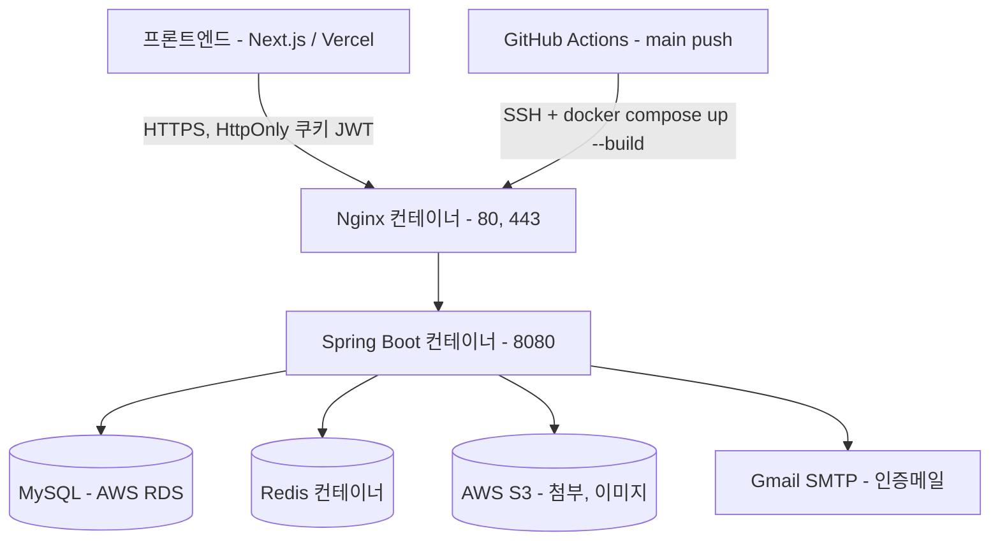
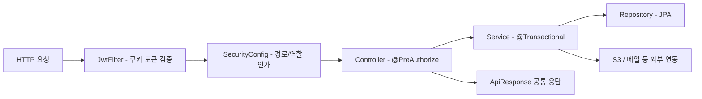
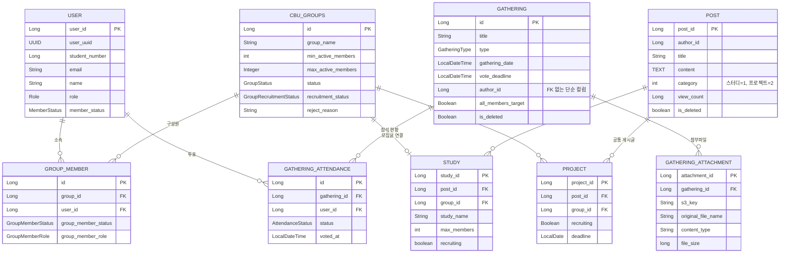

교내 개발 동아리 씨부엉의 운영을 하나로 묶은 백엔드 API 서버입니다. 지원서 접수·심사부터 스터디/프로젝트 팀 모집과 운영, 모임 참석 투표와 명단 관리까지를 다룹니다.

6인 팀에서 **모임(Gathering) · 그룹(Group) · 프로젝트 모집(Project) 도메인**을 담당했습니다.

## 개요

| 항목 | 내용 |
|---|---|
| 기간 | 2025.12 ~ 2026.07 (본인 참여 기간) |
| 역할 | 백엔드 개발 — 모임·그룹·프로젝트 모집 도메인 |
| 팀 구성 | 6명 |
| 저장소 | [cbu-manage/backend](https://github.com/cbu-manage/backend) |
| 규모 | Java 소스 229개 파일, 컨트롤러 21개, HTTP 매핑 134개 |

**기술 스택**

| 영역 | 사용 기술 |
|---|---|
| Language / Framework | Java 17, Spring Boot 3.3.5 |
| 영속성 | Spring Data JPA (Hibernate), MySQL (AWS RDS) |
| 캐시 · 인증 | Redis, Spring Security, JWT (jjwt) |
| 스토리지 | AWS S3 |
| 문서 처리 | Apache POI, PDFBox, hwplib, jsoup, Thumbnailator |
| 문서화 · 메일 | SpringDoc OpenAPI, Spring Mail (Gmail SMTP) |
| 인프라 | Docker, Nginx, GitHub Actions, Gradle |

## 아키텍처



Nginx·Spring Boot·Redis는 하나의 브리지 네트워크에서 함께 기동하고, MySQL만 외부 AWS RDS를 사용합니다. `main` 푸시 시 빌드 검증 → SSH 접속 → `docker compose up --build -d` 순으로 배포됩니다.

### 요청 처리 흐름



## 데이터 모델

담당 도메인(모임·그룹·모집 게시글)을 중심으로 한 핵심 엔티티입니다.



**모델 설계 메모**

- `POST`는 스터디·프로젝트·자료실·활동보고서가 공유하는 공통 게시글 테이블이고, `category` 정수 값으로 하위 타입을 구분합니다.
- `GATHERING.author_id`는 FK 없이 `Long` 컬럼으로만 들고 있어, 작성자 정보는 서비스 계층에서 일괄 조회해 조립합니다 (아래 문제 1 참고).
- `GATHERING_ATTENDANCE`는 `(gathering_id, user_id)` 유니크 제약으로 1인 1표를 DB 레벨에서 보장합니다.

## 주요 기능

담당 도메인 기준입니다.

| 기능 | 설명 |
|---|---|
| 모임 일정 관리 | 회의/MT/뒤풀이/행사/기타 5개 유형별 참석 대상 정책, 참석 투표(참석·불참·미응답), 투표 마감/자동 마감, 조회수, 소프트 딜리트 |
| 참석 명단 관리 | 일반용/관리자용 응답 분리(관리자만 학번·학과·학년·투표시각·미응답자 목록 노출), Apache POI 기반 참석 명단 엑셀 다운로드 |
| 모임 첨부파일 | S3 업로드, 확장자·용량(20MB) 화이트리스트 검증, presigned URL 다운로드(TTL 5분), 한글 파일명 인코딩 |
| 그룹 운영 | 모집글 작성 시 그룹 자동 생성 및 작성자 리더 등록, 가입 신청/취소/수락/거절(사유 포함), 정원 도달 시 자동 마감, 관리자 승인·반려·재신청 흐름 |
| 프로젝트/스터디 모집 게시글 | 모집 분야·마감일·태그, 현재 인원/최대 인원 표시, 내가 쓴 글·신청한 글 페이징 조회 |

## 기술적으로 해결한 문제

### 1. 모임 목록 조회 N+1 제거

모임 목록 응답 한 건에는 작성자 정보, 내 투표 상태, 참석 집계가 모두 필요해 `1(목록) + N(작성자) + N(참석)` 형태로 쿼리가 나갔습니다. 작성자는 FK 연관이 아니라 `Gathering.authorId`(Long)로만 들고 있어 **fetch join으로 풀 수 없었고**, 회의·MT 유형은 생성 시점에 전체 활동 회원을 `NOT_RESPONDED`로 일괄 생성해 모임 하나당 참석 레코드가 회원 수만큼 쌓였습니다. 목록을 먼저 조회한 뒤 작성자 ID 집합과 모임 ID 집합으로 각각 한 번씩만 일괄 조회하고 메모리에서 `Map`으로 조립하도록 바꿨습니다 — **연관관계를 새로 걸어 fetch join을 쓰는 대신, 도메인 결합을 늘리지 않는 쪽을 택했습니다.**

첨부파일도 같은 이유로 목록에서 빼고 상세 조회에서만 내려주도록 API를 분리했고, 단건 조회에서는 참석 레코드를 전부 로딩하는 대신 상태별 `COUNT` 3회로 요약을 계산하도록 목록용·단건용 집계를 나눴습니다.

| 항목 | 개선 전 | 개선 후 |
|---|---|---|
| 목록 조회 쿼리 수 (모임 N건) | 1 + 2N | **3 (고정)** |
| 목록 응답의 첨부파일 | 모임당 1회 추가 조회 | 목록에서 제외 |
| 단건 조회 참석 집계 | 전체 로딩 후 계산 | 상태별 `COUNT` 3회 |

쿼리 수는 코드에서 도출한 값이고, 응답시간·처리량은 측정하지 않았습니다.

<details>
<summary>일괄 조회 후 Map 으로 조립하는 코드</summary>

```java
List<Gathering> gatherings = gatheringRepository.findAllByIsDeletedFalseOrderByGatheringDateDesc();
List<Long> gatheringIds = gatherings.stream().map(Gathering::getId).toList();

Set<Long> authorIds = gatherings.stream().map(Gathering::getAuthorId).collect(Collectors.toSet());
Map<Long, User> authorMap = userRepository.findAllById(authorIds).stream()
        .collect(Collectors.toMap(User::getUserId, m -> m));

List<GatheringAttendance> allAttendances = attendanceRepository.findAllByGatheringIdIn(gatheringIds);

Map<Long, List<GatheringAttendance>> attendanceByGathering = allAttendances.stream()
        .collect(Collectors.groupingBy(a -> a.getGathering().getId()));

Map<Long, AttendanceStatus> myStatusByGathering = allAttendances.stream()
        .filter(a -> a.getMember().getUserId().equals(memberId))
        .collect(Collectors.toMap(a -> a.getGathering().getId(), GatheringAttendance::getStatus));
```

</details>

### 2. multipart JSON 파트가 415로 거부되던 문제

모임 등록 API는 모임 정보(JSON)와 첨부파일을 함께 받는 `multipart/form-data` 엔드포인트인데, 클라이언트가 JSON 파트에 `Content-Type`을 붙이지 않으면 서버가 `415 Unsupported Media Type`으로 거부했습니다. `@RequestPart`는 파트별 `Content-Type`을 보고 메시지 컨버터를 고르는데, 타입이 없으면 `application/octet-stream`으로 들어오고 **Jackson 컨버터의 지원 목록에는 그 타입이 없어** "처리할 컨버터가 없음"으로 판정됩니다. 본문의 JSON 자체는 정상인데 타입 협상 단계에서 막히는 문제였습니다.

Jackson 컨버터의 지원 미디어 타입에 `application/octet-stream`을 추가하는 전역 설정을 넣었습니다 — **컨트롤러마다 우회 코드를 넣으면 multipart 엔드포인트가 늘어날 때마다 같은 버그가 재발하므로, 한 곳에서 끝내는 편이 낫다고 판단**했습니다.

| 항목 | 개선 전 | 개선 후 |
|---|---|---|
| JSON 파트에 `Content-Type` 미지정 | `415 Unsupported Media Type` | 정상 역직렬화 |
| 클라이언트 대응 | 파트별 타입 수동 지정 필요 | 불필요 |
| 적용 범위 | — | 전역 (multipart 전체) |

<details>
<summary>WebConfig 전역 설정</summary>

```java
@Override
public void extendMessageConverters(List<HttpMessageConverter<?>> converters) {
    converters.stream()
            .filter(MappingJackson2HttpMessageConverter.class::isInstance)
            .map(MappingJackson2HttpMessageConverter.class::cast)
            .forEach(converter -> {
                List<MediaType> supportedMediaTypes = new ArrayList<>(converter.getSupportedMediaTypes());
                supportedMediaTypes.add(MediaType.APPLICATION_OCTET_STREAM);
                converter.setSupportedMediaTypes(supportedMediaTypes);
            });
}
```

</details>

### 3. S3와 DB 트랜잭션 사이의 정합성 확보

첨부파일의 바이트는 S3에, 메타데이터는 MySQL에 나눠 저장하는데 둘이 한 트랜잭션으로 묶이지 않아 **양방향으로 불일치**가 생길 수 있었습니다. S3 업로드 후 DB 저장이 실패하면 아무도 참조하지 않는 **고아 객체**가 남고, 트랜잭션 안에서 DB·S3를 함께 지우다 롤백되면 레코드는 살아 있는데 파일만 사라진 **유령 레코드**가 됩니다.

원인은 "외부 저장소 호출을 트랜잭션 경계와 무관하게 호출한다"는 점 하나였습니다. 업로드는 S3 키를 저장해야 하니 커밋 **전**에, 삭제는 롤백 가능성 때문에 커밋 **후**에 일어나야 합니다 — **요구 시점이 정반대라 같은 방식으로 처리할 수 없다고 보고 방향별로 전략을 나눴습니다.** 업로드는 실패 시 방금 올린 객체를 되돌리는 보상 삭제로, 삭제는 `TransactionSynchronization`의 `afterCommit` 훅으로 미뤘습니다.

| 시나리오 | 개선 전 | 개선 후 |
|---|---|---|
| 업로드 성공 + DB 저장 실패 | S3에 고아 객체 잔존 | 보상 삭제로 정리 |
| DB 삭제 후 롤백 | 레코드는 살고 파일만 손실 | S3 삭제가 커밋 뒤로 지연 |
| 보상 삭제 자체가 실패 | — | 원래 예외를 그대로 전파 |

<details>
<summary>방향별 보정 코드</summary>

```java
// 업로드: DB 저장 실패 시 방금 올린 S3 객체를 되돌린다
try {
    return gatheringAttachmentRepository.save(
            GatheringAttachment.create(gathering, key, fileName, contentType, file.getSize())
    );
} catch (RuntimeException e) {
    deleteQuietly(key);
    throw e;
}

// 삭제: DB 삭제가 커밋된 다음에만 S3 객체를 지운다
private void deleteObjectAfterCommit(String s3Key) {
    TransactionSynchronizationManager.registerSynchronization(new TransactionSynchronization() {
        @Override
        public void afterCommit() {
            deleteQuietly(s3Key);
        }
    });
}
```

보상 삭제는 `deleteQuietly()`로 best-effort 처리했습니다. 여기서 예외를 다시 던지면 원래의 실패 원인이 가려지고, 최악의 경우에도 남는 것은 참조되지 않는 객체뿐이기 때문입니다.

이미지와 일반 파일의 URL 정책도 나눴습니다 — 본문에 계속 노출되는 이미지는 만료되지 않는 public URL을, 다운로드용 첨부는 TTL 5분 presigned URL을 내려줍니다.

</details>

### 4. PATCH 부분 수정의 null 덮어쓰기 수정

모임 수정은 `PATCH`로 일부 필드만 보내는 전제로 설계했는데, 실제로는 요청에 담지 않은 필드가 전부 `null`로 지워졌습니다. 장소만 바꾸려고 `location`만 보내면 제목·설명·모임 일시가 함께 날아갔습니다. 요청 DTO가 record라 생략된 필드는 `null`로 역직렬화되는데, 엔티티의 수정 메서드가 받은 값을 무조건 대입하고 있어, **"값을 보내지 않았다"와 "값을 null로 지워달라"를 구분하지 못한 것**이 원인이었습니다. 수정 메서드에서 null이 아닌 필드만 반영하도록 바꿨습니다.

투표 마감 시각은 "null = 마감 없음"이라는 별도 의미가 있어 처음에는 무조건 반영했는데, **코드리뷰에서 다른 필드만 수정할 때 마감 시각이 사라진다는 지적**을 받고 이 필드에도 null 가드를 넣었습니다. 함께 모임 유형은 수정 불가로 막았습니다 — 유형이 바뀌면 참석 대상 집합 자체(전체 자동 포함 ↔ 신청 투표)가 달라져 이미 쌓인 투표 데이터의 의미가 깨지기 때문입니다.

| 요청 | 개선 전 | 개선 후 |
|---|---|---|
| 장소만 담아 전송 | 나머지 필드가 null 로 덮어써짐 | 보낸 필드만 반영 |
| 투표 마감 시각 생략 | 마감 시간 손실 | 기존 값 유지 |
| 모임 유형 변경 시도 | 반영되어 투표 정합성 붕괴 | 400 으로 거부 |

### 5. 모집 상태 전이 일원화

스터디·프로젝트 모집은 "게시글(Post + Study/Project)"과 "팀(Group + GroupMember)" 두 축으로 나뉘는데, 모집 상태 플래그가 **그룹 쪽과 게시글 쪽 양쪽에 따로 존재**했습니다. 한쪽만 바뀌면 목록에는 "모집중"인데 실제로는 신청이 막히는 불일치가 생겼고, 정원이 찼는데 계속 모집중으로 노출되거나 마감 후 대기 신청자가 방치되는 문제도 함께 있었습니다.

상태 변경 진입점이 여러 곳(리더의 수동 마감, 멤버 승인으로 인한 정원 도달, 관리자 반려)인데 **각 진입점이 자기 쪽 플래그만 갱신**하고 있었습니다. 진입점마다 고치면 다음 진입점이 생길 때 같은 버그가 재발하므로, **모집 상태를 바꾸는 모든 경로가 그룹 도메인 서비스 한 곳을 거치도록 묶었습니다.**

| 상황 | 개선 전 | 개선 후 |
|---|---|---|
| 리더가 모집 마감 | 그룹만 CLOSED, 게시글은 "모집중" | 게시글 플래그도 함께 false |
| 정원 도달 | 수동 마감 필요 | 자동 마감 + 게시글 동기화 |
| 마감 시 PENDING 신청자 | 무기한 대기 | 사유와 함께 일괄 REJECTED |
| 관리자 반려 후 재제출 | 별도 경로 없음 | 마감 시 RESUBMITTED로 전환 |
| 최대 인원 축소 | 현재 인원보다 작게 설정 가능 | 400 + 현재 인원 안내 |

<details>
<summary>상태 전이를 한 곳으로 모은 코드</summary>

```java
boolean recruiting = (targetStatus == GroupRecruitmentStatus.OPEN);
if (recruiting) {
    group.openRecruitment();
} else {
    // 모집 마감 시 대기(PENDING) 신청자는 사유와 함께 거절(REJECTED) 처리
    rejectAllPendingMembers(groupId);
    // 관리자가 반려했던 그룹의 리더가 모집 마감을 다시 누르면 재신청(RESUBMITTED)으로 전환
    if (group.getStatus() == GroupStatus.REJECTED) {
        group.resubmit();
    }
    group.closeRecruitment();
}
projectRepository.findByGroupId(groupId).ifPresent(project -> project.updateRecruiting(recruiting));
studyRepository.findByGroupId(groupId).ifPresent(study -> study.updateRecruiting(recruiting));
```

멤버 승인 경로에도 같은 동기화를 넣어, 현재 인원이 최대 인원에 도달하면 모집을 자동 마감하고 게시글 플래그까지 내리도록 했습니다.

</details>

## 담당 범위

참여 기간은 2025.12 ~ 2026.07이고, 아래가 제가 설계·구현한 영역입니다.

| 도메인 | 담당 범위 |
|---|---|
| **모임(Gathering)** | 도메인 전체 설계·구현 — 엔티티, 서비스, 컨트롤러, DTO, 매퍼, 첨부파일, 엑셀 내보내기 |
| **그룹(Group)** | 도메인 전체 설계·구현 — 그룹 생성/가입/승인/반려, 관리자 승인 흐름, 페이징 조회 |
| **프로젝트 모집(Project)** | 게시글 작성/수정/삭제, 모집 분야·마감일, 목록·상세 조회, 현재 인원 표시 |
| **게시글 공통(Post)** | 조회수 필드 및 증가 로직, 소프트 딜리트, 작성자 기수·이름 응답 |
| **전역 설정** | multipart JSON 파트 처리 `WebConfig`, GROUP/GATHERING 에러코드 정의 |


## 배운 점

**연관관계를 걸지 않은 대가는 조회 계층에서 치른다.** `Gathering.authorId`처럼 FK 없이 ID만 들고 있으면 도메인 결합은 줄지만 fetch join을 쓸 수 없어 N+1을 서비스 계층에서 직접 막아야 합니다. 목록 API는 "쿼리 수가 데이터 건수에 비례하지 않는가"를 먼저 확인하는 습관이 생겼습니다.

**트랜잭션 경계 밖의 작업은 롤백되지 않는다.** S3처럼 트랜잭션에 참여하지 않는 외부 저장소는 커밋 시점을 기준으로 "커밋 전에 해야 할 일"과 "커밋 후에 해야 할 일"을 나눠야 한다는 것을, 고아 객체와 유령 레코드라는 두 방향의 불일치를 겪으며 배웠습니다.

**PATCH에서 null은 두 가지 의미를 가진다.** "보내지 않음"과 "비워달라"를 구분하지 못하면 부분 수정 API는 반드시 데이터를 지웁니다. 필드마다 null의 의미를 먼저 정의하고 시작해야 한다는 것을 실제 버그로 확인했습니다.

**상태 전이는 진입점이 아니라 한 곳에 모아야 한다.** 모집 상태 플래그가 두 테이블에 흩어져 있으니 진입점이 늘어날 때마다 같은 불일치 버그가 반복됐습니다. 도메인 서비스 한 곳에서 전이를 책임지도록 모으고 나서야 재발이 멈췄습니다.

**코드리뷰가 잡아준 것은 기능이 아니라 경계 조건이었다.** `voteDeadline` null 가드, 전체 대상 생성 시 활동 회원만 포함, `NOT_RESPONDED`로의 직접 투표 차단 등은 모두 리뷰 과정에서 나온 것들입니다. 정상 흐름보다 예외 입력을 먼저 정의하는 편이 결국 빠르다는 것을 체감했습니다.
