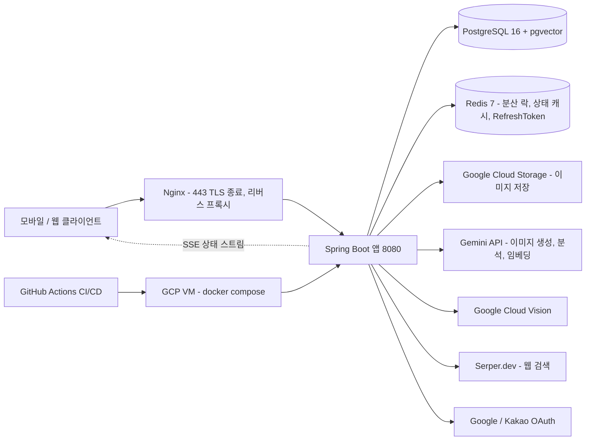
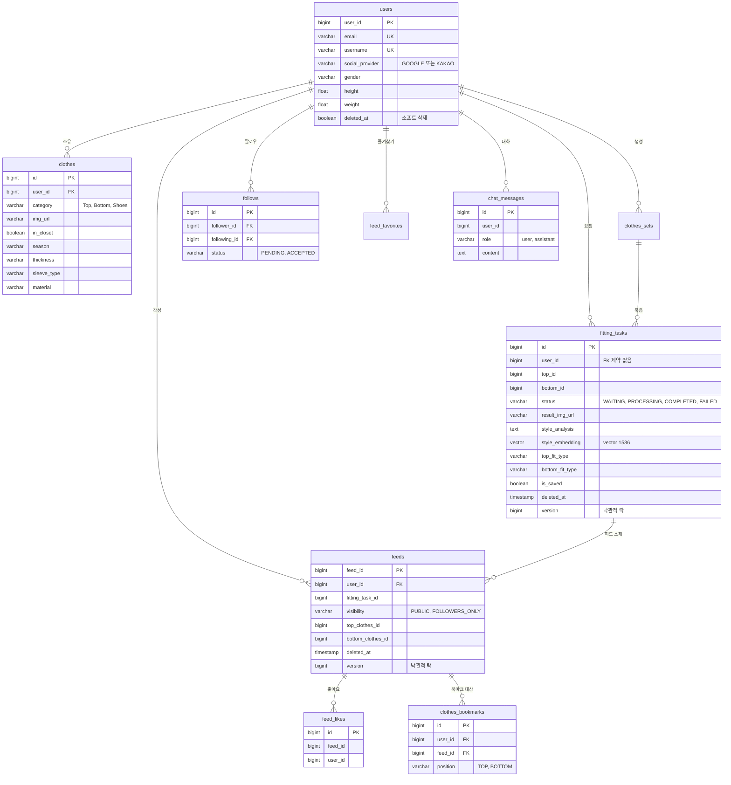

사용자 사진과 옷 사진을 올리면 생성형 AI가 착장 이미지를 합성하고, 그 결과를 벡터로 임베딩해 날씨·스타일 기반으로 코디를 추천하며 피드로 공유할 수 있는 서비스입니다. 졸업작품으로 진행했고 백엔드 전반을 담당했습니다.

## 개요

| 항목 | 내용 |
|---|---|
| 기간 | 2026.01 ~ 2026.05 |
| 역할 | 백엔드 개발 — 가상 피팅 파이프라인, 비동기·SSE, AI 추천/챗봇, 인증, 인프라·CI/CD |
| 팀 구성 | 3명 |
| 저장소 | [2026-TU-Capstone-Project/Backend](https://github.com/2026-TU-Capstone-Project/Backend) |

**기술 스택** — Java 21, Spring Boot 3.4, Spring Data JPA, Spring Security, Spring WebFlux(WebClient), PostgreSQL 16 + pgvector, Redis 7, Hibernate 6.6(hibernate-vector), JJWT, Google Cloud Storage / Vision, Gemini API, Docker Compose, Nginx, GitHub Actions

## 아키텍처



## 데이터 모델



위 외에 `comments`, `body_measurements`, `clothes_upload_tasks`, `clothes_set_items` 엔티티가 더 있습니다. 스키마는 `ddl-auto=update`로 엔티티에서 생성되며, `init.sql`은 `CREATE EXTENSION vector`와 권한 부여만 수행합니다.

## 주요 기능

- **AI 가상 피팅** — 전신 사진 + 상의(필수)/하의(선택)를 업로드하면 `202 Accepted`와 taskId를 즉시 반환하고, 백그라운드에서 Gemini 이미지 모델로 착장을 합성합니다. 핏 타입(SLIM/REGULAR/OVERSIZED)을 상·하의 각각 지정하면 프롬프트에 반영됩니다.
- **작업 상태 실시간 스트리밍(SSE)** — `GET /api/v1/virtual-fitting/{taskId}/stream`, `GET /api/v1/clothes/upload/{taskId}/stream`
- **옷장** — 옷 사진 업로드 시 Gemini가 색상·소재·시즌·두께·소매 등 15개 속성을 JSON으로 분석해 저장합니다.
- **스타일 추천** — 피팅 결과 이미지를 텍스트로 분석 → 1536차원 임베딩 → pgvector 코사인 거리 검색. 전체 / 내 옷장 / 피드 범위와 성별 필터를 제공합니다.
- **날씨 기반 추천** — 기온 5단계 + 비/눈/바람/습도 조건으로 가산점을 매겨 재정렬합니다.
- **어시스턴트 챗봇** — Gemini function calling으로 `recommend_from_my_closet` / `recommend_from_feed` / `search_web_styles` 3개 툴을 호출하고 대화 이력을 DB에 저장합니다.
- **소셜 로그인·JWT** — Google/Kakao 네이티브 SDK 토큰 검증 후 자체 accessToken 발급, refreshToken은 Redis 저장 + 갱신 시 rotation.
- **피드(SNS)** — 공개범위(PUBLIC / FOLLOWERS_ONLY), 좋아요, 즐겨찾기, 피드에 걸린 옷 북마크, 페이지네이션.

## 기술적으로 해결한 문제

### 1. 외부 AI 호출 구간의 DB 커넥션 점유 제거

가상 피팅 전체 프로세스를 처리하는 메서드에 `@Async`와 `@Transactional`이 함께 붙어 있었고, 내부에서 호출하는 Gemini 이미지 생성 API의 타임아웃이 **180초**였습니다. 요청 하나가 최악의 경우 3분 동안 DB 커넥션을 점유한 채 외부 API 응답만 기다렸고, HikariCP 기본 풀이 10이라 동시 피팅이 10건을 넘으면 **피드 조회 같은 무관한 API까지** 커넥션을 얻지 못했습니다.

트랜잭션 경계 안에 Gemini 호출 3회·GCS 업로드·임베딩 생성이 전부 들어 있는데 실제 DB 작업은 상태 갱신 UPDATE 몇 건뿐이었습니다. **트랜잭션 수명이 외부 I/O 전체 길이에 묶여 있는 것**이 원인이라, 비동기 진입 메서드에서 `@Transactional`을 떼고 DB 접근만 짧은 트랜잭션 메서드로 쪼갰습니다. 동시에 직렬 실행이던 피팅과 옷 분석을 `CompletableFuture`로 나란히 띄우고, 결과 URL과 COMPLETED를 먼저 커밋해 SSE로 내려준 뒤 나머지를 후처리로 돌렸습니다.

| 항목 | 개선 전 | 개선 후 |
|---|---|---|
| 트랜잭션 경계 | 비동기 메서드 전체 (외부 API 3회 포함) | 상태 UPDATE 단위 |
| 커넥션 점유 | Gemini 응답 대기(최대 180초)만큼 | 외부 I/O 구간에는 미보유 |
| 피팅 / 옷분석 | 분석 완료 후 피팅 시작 (직렬) | 동시 실행 |
| 사용자 응답 시점 | 후처리까지 끝난 뒤 | 결과 이미지 저장 직후 |
| HikariCP 풀 | 10 | 30 |

<details>
<summary>비동기·트랜잭션 분리 코드</summary>

```java
/** 트랜잭션 없음: 내부에서 updateTaskStatus 등 짧은 트랜잭션만 사용.
    Gemini 대기 구간에서 커넥션을 보유하지 않는다. */
@Async("taskExecutor")
public void processVirtualFittingWithClothesAnalysis(...) {
    // 1. 가장 오래 걸리는 피팅을 먼저 시작
    final CompletableFuture<Void> fittingFuture = CompletableFuture.runAsync(
            () -> processFitting(taskId, userImageBytes, ..., topFitType, bottomFitType), taskExecutor);

    // 2. 2초 뒤 상·하의 분석을 동시에 시작 (Gemini 동시 호출 완화)
    topAnalysisFuture = CompletableFuture.supplyAsync(() -> {
        Thread.sleep(2000);
        return clothesAnalysisService.analyzeAndSaveClothes(topImageBytes, topImageFilename, "Top", user);
    }, taskExecutor);

    // 3. 분석이 끝나면 clothes id 만 FittingTask 에 연결
    CompletableFuture.allOf(topAnalysisFuture, bottomAnalysisFuture).thenRunAsync(..., taskExecutor);
}
```

옷 분석 서비스도 같은 원칙으로 재구성해 GCS 업로드와 Gemini 호출은 트랜잭션 밖, DB 저장만 `@Transactional`로 두었습니다.

</details>

### 2. 상태 폴링을 SSE 푸시로 전환

가상 피팅은 완료까지 수십 초가 걸리는 비동기 작업이라, 초기에는 클라이언트가 `GET /{taskId}/status`를 반복 호출해 완료를 감지해야 했습니다. 작업 하나당 불필요한 요청이 반복되고 완료 시점과 인지 시점 사이에 폴링 주기만큼 지연이 생겼습니다. **상태 변경은 서버가 알고 있는데 전달할 통로가 없어 클라이언트가 되묻는 방식밖에 없었던 것**이 원인이고, 상태 변화 지점이 두 메서드로 이미 좁혀져 있어 **거기서 직접 밀어주면 폴링이 필요 없다**고 판단했습니다.

`SseEmitter`를 task 단위로 관리하는 서비스를 만들고 상태를 바꾸는 트랜잭션 메서드에서 곧바로 이벤트를 발행합니다. 구독 시점에 이미 작업이 끝나 있으면 현재 상태를 1회 전송하고 바로 닫아, **늦게 접속한 클라이언트도 결과를 놓치지 않게** 했습니다. 기존 폴링 API는 하위 호환을 위해 남기되 Redis에 10초 TTL 캐시를 씌워 DB 조회를 줄였습니다.

| 항목 | 개선 전 (폴링) | 개선 후 (SSE) |
|---|---|---|
| 상태 전달 | 클라이언트 주기적 요청 | 서버 푸시 |
| 작업당 요청 수 | 완료까지 폴링 횟수만큼 | 스트림 연결 1건 |
| 완료 인지 지연 | 폴링 주기만큼 | 상태 변경 즉시 |
| 연결 관리 | 해당 없음 | task당 1연결, 타임아웃 정리, 완료 시 종료 |

<details>
<summary>SseEmitter 관리 코드</summary>

```java
public SseEmitter register(Long taskId) {
    SseEmitter existing = emitters.remove(taskId);   // task 당 1연결 보장
    if (existing != null) { try { existing.complete(); } catch (Exception ignored) {} }
    SseEmitter emitter = new SseEmitter(SSE_TIMEOUT_MS);
    emitters.put(taskId, emitter);
    emitter.onCompletion(() -> emitters.remove(taskId, emitter));
    emitter.onTimeout(()    -> emitters.remove(taskId, emitter));
    emitter.onError(e       -> emitters.remove(taskId, emitter));
    return emitter;
}

public void notifyStatus(Long taskId, VirtualFittingStatusResponse response) {
    SseEmitter emitter = emitters.get(taskId);
    if (emitter == null) return;
    emitter.send(SseEmitter.event().name("status").data(objectMapper.writeValueAsString(response)));
    if (response.getStatus() == FittingStatus.COMPLETED || response.getStatus() == FittingStatus.FAILED) {
        emitters.remove(taskId, emitter);
        emitter.complete();   // 완료 후 연결 종료
    }
}
```

</details>

### 3. 병렬화가 부른 Gemini 429 대응

1번을 병렬화로 풀고 나자 새 문제가 생겼습니다. 요청 1건이 피팅 1회 + 상의 분석 1회 + 하의 분석 1회, 총 3개의 Gemini 호출을 거의 동시에 발생시키면서 **429 Too Many Requests**가 났습니다. **병렬화 자체가 실패 원인이 된 상황**입니다.

호출 3건이 같은 시각에 몰리는 구조라 재시도만으로는 같은 시각에 다시 몰릴 뿐이었습니다. **시각 대비 호출 수를 줄이는 것과, 그래도 나는 429를 흡수하는 것 두 겹이 필요**하다고 보고, 옷 분석 시작을 2초 지연시켜 피팅 호출과 시간대를 어긋나게 하고(스태거링) 429일 때만 지연 후 재시도하는 공통 래퍼를 만들었습니다.

| 항목 | 개선 전 | 개선 후 |
|---|---|---|
| 시각 대비 호출 | 3건 동시 | 피팅 1건 → 2초 뒤 분석 2건 |
| 429 대응 | 없음 (즉시 실패) | 최대 3회, 대기 3초·6초 |
| 부분 실패 | 전체 실패 | 분석·업로드 실패해도 피팅은 유지 |
| 응답 버퍼 | 기본 256KB | 10MB |

<details>
<summary>재시도 래퍼 코드</summary>

```java
private String callGeminiWithRetry(String endpoint, Map<String, Object> requestBody) {
    for (int attempt = 1; attempt <= MAX_RETRIES; attempt++) {          // MAX_RETRIES = 3
        try {
            return geminiWebClient.post().uri(...).bodyValue(requestBody)
                    .retrieve().bodyToMono(String.class)
                    .timeout(Duration.ofSeconds(180)).block();
        } catch (Exception e) {
            boolean isRateLimit = e.getMessage() != null && e.getMessage().contains("429");
            if (isRateLimit && attempt < MAX_RETRIES) {
                long delay = RETRY_BASE_DELAY_MS * attempt;              // 3초 → 6초
                Thread.sleep(delay);
            } else { throw e; }
        }
    }
    throw new RuntimeException("Gemini API 호출 실패: 최대 재시도 횟수 초과");
}
```

</details>

### 4. LLM 출력 표기 불일치로 날씨 가산점이 0이던 문제

피팅 결과를 1536차원으로 임베딩해 pgvector 코사인 거리로 유사 코디를 찾는 추천에, 기온 5단계와 비·눈·바람·습도로 가산점을 주는 날씨 추천을 얹었는데 **가산점이 사실상 항상 0**이라 날씨를 바꿔도 순서가 그대로였습니다.

가산점은 옷의 계절·두께·소매 속성을 문자열로 비교하는데, 이 값들은 **Gemini가 사진을 보고 생성해 저장한 값**이었습니다. 초기 프롬프트가 "한국어 JSON으로만 답변"까지만 지시하고 허용값을 명시하지 않아 같은 여름옷이 `"여름"`, `"Summer"`, `"여름/봄"`처럼 매번 다르게 저장되고 있었습니다. **LLM 출력을 입력 데이터가 아니라 스키마가 있는 필드로 다루기로** 하고 프롬프트에서 각 필드의 허용값을 열거해 저장값을 고정했으며, 비교 단계에도 한국어↔영어 정규화를 두어 이중으로 방어했습니다.

| 항목 | 개선 전 | 개선 후 |
|---|---|---|
| 옷 속성 저장값 | 표기 제각각 (`여름`/`Summer`/`여름/봄`) | 필드별 허용값 고정 |
| 날씨 가산점 | 매칭 실패로 항상 0 | 기온 5단계 + 날씨 상태 반영 |
| 가산점 상한 | — | 기온 0.15 + 상태 0.10 (총 0.20) |
| 추천 흐름 | 유사도 top-N 단독 | 후보 30 → 가산점 → 상위 10 재정렬 |

<details>
<summary>프롬프트 제약과 정규화, 벡터 검색 쿼리</summary>

```java
// 프롬프트: 허용값 명시로 DB 저장값 일관성 보장
"""
각 필드는 반드시 아래 허용값 중 하나로만 답해줘:
- season: 봄, 여름, 가을, 겨울, 사계절 중 하나
- thickness: 얇음, 보통, 두꺼움 중 하나
- sleeveType: 반팔, 긴팔, 민소매, 없음 중 하나 (하의는 없음)
- category: 상의, 하의, 신발, 아우터, 액세서리 중 하나
"""

// 비교 단계: 저장값을 다시 정규화
private String norm(String s) {
    return switch (s.trim()) {
        case "봄" -> "spring";  case "여름" -> "summer";
        case "얇음" -> "thin";  case "두꺼움" -> "thick";
        case "반팔" -> "short"; case "민소매" -> "sleeveless";
        default -> s.trim().toLowerCase();
    };
}
```

```sql
SELECT ft.id, (ft.style_embedding <=> CAST(:queryVector AS vector)) AS distance
FROM fitting_tasks ft
WHERE ft.style_embedding IS NOT NULL AND ft.deleted_at IS NULL AND ft.is_saved = true
  AND (:maxDistance IS NULL OR (ft.style_embedding <=> CAST(:queryVector AS vector)) <= :maxDistance)
  AND (:gender IS NULL OR ft.result_gender::text = :gender)
ORDER BY distance LIMIT :limit
```

가산점 상한(기온 0.15 + 날씨상태 0.10)을 둔 것은 유사도라는 1차 기준이 날씨에 뒤집히지 않게 하기 위해서입니다.

</details>

### 5. 동시 요청과 외부 저장소의 정합성 확보

세 가지 정합성 문제가 있었습니다. 피팅 버튼 연타로 같은 요청이 여러 건 생성돼 비싼 Gemini 호출이 중복됐고, 옷 삭제 시 GCS 삭제가 커밋 전에 실행돼 롤백되면 **DB에는 옷이 남았는데 이미지만 사라졌으며**, 피팅 결과를 hard delete 하면 그 이미지를 참조하던 피드가 깨졌습니다. 세 번째는 `fitting_tasks`가 `feeds`에서 **FK 제약 없이**(`ConstraintMode.NO_CONSTRAINT`) 참조돼 DB가 막아주지 않는 구조가 원인이었습니다.

**문제 성격이 달라 락 전략을 나눴습니다.** 중복 요청은 서버 상태가 아니라 요청 단위 문제라 Redis SETNX 분산 락으로, GCS 삭제는 `afterCommit` 훅으로 미루고, 참조 깨짐은 soft delete로 바꾼 뒤 실제 물리 삭제는 주 1회 스케줄러가 **참조가 남아 있지 않은 것만** 골라 수행하도록 분리했습니다.

| 상황 | 개선 전 | 개선 후 |
|---|---|---|
| 피팅 요청 연타 | 중복 작업 생성 | Redis 락 30초, 초과 시 409 |
| 옷 삭제 시 GCS | 커밋 전 삭제 → 롤백 시 파일 유실 | `afterCommit` 에서만 삭제 |
| 피팅 결과 삭제 | hard delete → 피드 참조 깨짐 | soft delete + 7일 후 참조 검사 |
| 동시 수정 | 마지막 쓰기가 덮어씀 | `@Version` 낙관적 락 |
| 이메일 중복 가입 경합 | 동시 INSERT 시 예외 | `DataIntegrityViolationException` 처리 |

<details>
<summary>락 전략과 정리 스케줄러 코드</summary>

```java
// 1) 중복 요청: Redis SETNX 분산 락 (동일 유저 30초 1건)
final String lockKey = "lock:fitting-create:" + userId;
if (!RedisLockService.tryLock(lockKey, Duration.ofSeconds(30))) {
    return ResponseEntity.status(HttpStatus.CONFLICT)
            .body(ApiResponse.error("이미 가상 피팅 요청이 처리 중입니다. 잠시 후 다시 시도해주세요."));
}

// 2) GCS 삭제는 DB 커밋 성공 후에만
TransactionSynchronizationManager.registerSynchronization(new TransactionSynchronization() {
    @Override public void afterCommit() {
        try { gcsService.deleteImage(blobName); }
        catch (Exception e) { log.warn("GCS 이미지 삭제 실패 (DB는 이미 커밋됨): {}", blobName, e); }
    }
});
```

```java
@Scheduled(fixedDelay = 7 * 24 * 60 * 60 * 1000L)
public void cleanupSoftDeletedTasks() { /* deleted_at < now-7d 대상 */ }

private void deleteClothesIfVirtualFittingOnly(Long clothesId, Long taskId) {
    if (fittingRepository.existsByTopId(clothesId) || fittingRepository.existsByBottomId(clothesId)) return;
    if (feedRepository.existsActiveFeedReferencingClothes(clothesId)) return;   // 피드가 참조 중이면 보존
    clothesRepository.findByIdForUpdate(clothesId)                              // 비관적 락
            .ifPresent(clothes -> { if (!clothes.isInCloset()) { /* GCS + DB 삭제 */ } });
}
```

</details>

## 담당 범위

3인 팀에서 백엔드 전반을 맡았고, 아래가 제가 설계·구현한 영역입니다.

- 가상 피팅 파이프라인 (비동기·트랜잭션 분리·병렬화)
- Gemini 연동 (이미지 생성·분석·임베딩·재시도·리사이징)
- SSE 실시간 상태 전달
- 어시스턴트 챗봇 (function calling·웹검색·대화 이력)
- pgvector 스타일 추천 · 날씨 가산점
- soft delete 전환 + 정리 스케줄러
- 동시성·정합성 개선
- 인증 (JWT 필터·시큐리티 설정·소셜 로그인·RefreshToken)
- GCS·Vision 연동
- 인프라·CI/CD (Docker Compose, Nginx, GitHub Actions, Actuator/로그)

## 배운 점

**트랜잭션 경계는 "DB를 만지는 구간"까지여야 한다.** `@Transactional`이 비동기 메서드 전체에 붙어서 생기는 커넥션 점유 문제는, 개발 환경처럼 요청이 한두 건일 때는 전혀 드러나지 않았습니다. 외부 API 호출이나 파일 업로드처럼 응답 시간을 통제할 수 없는 작업은 트랜잭션 밖으로 빼고, DB 쓰기만 짧게 감싸는 습관을 갖게 됐습니다.

**성능 개선은 새로운 실패 모드를 만든다.** 직렬을 병렬로 바꾸자 곧바로 429 rate limit이 나타났습니다. 병렬화의 이득을 지키려면 스태거링·재시도·부분 실패 허용까지 함께 설계해야 한다는 것을 배웠습니다. 지금 코드에서 옷 분석이 실패해도 피팅 결과는 살아남는 구조가 그 결과입니다.

**LLM 출력은 입력 데이터로 취급해야 한다.** 날씨 가산점이 0이던 버그의 원인은 로직이 아니라 "저장된 값의 표기가 제각각"이라는 데이터 품질 문제였습니다. 이후로는 LLM 응답을 저장할 때 허용값을 프롬프트에 못 박고, 코드 쪽에서도 정규화하는 이중 방어를 기본으로 삼고 있습니다.

**삭제는 가장 위험한 연산이다.** FK 제약 없이 여러 테이블이 서로를 참조하는 구조에서 hard delete는 조용히 데이터를 깨뜨립니다. soft delete로 즉시 응답을 보장하고 실제 정리는 참조 검사를 거쳐 배치로 넘기는 패턴이, 사용자 경험과 정합성을 동시에 지키는 방법이었습니다.

**남은 과제도 명확해졌다.** `style_embedding`에 벡터 인덱스(HNSW/IVFFlat)를 만들지 않아 유사도 검색이 전체 스캔으로 동작합니다. 데이터가 쌓이면 병목이 될 지점이고, 현재 스키마 관리가 `ddl-auto=update`라 마이그레이션 도구 도입과 함께 풀어야 할 과제로 남았습니다. 또 테스트가 컨텍스트 로딩 검증 1건뿐이라, 위에서 다룬 동시성·트랜잭션 개선들을 회귀 검증할 테스트가 없다는 점이 가장 아쉽습니다.
