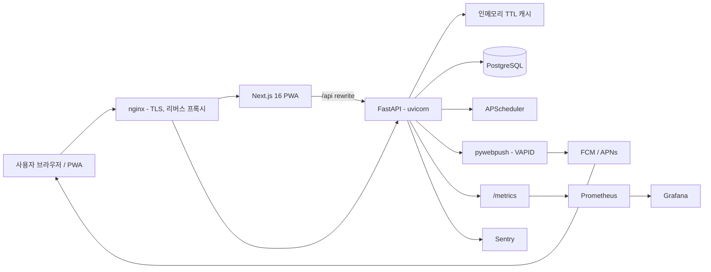
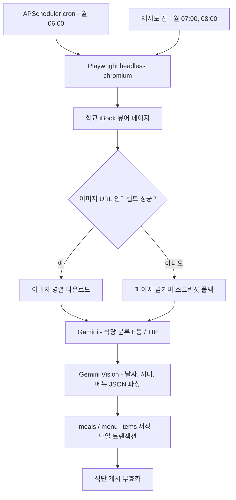
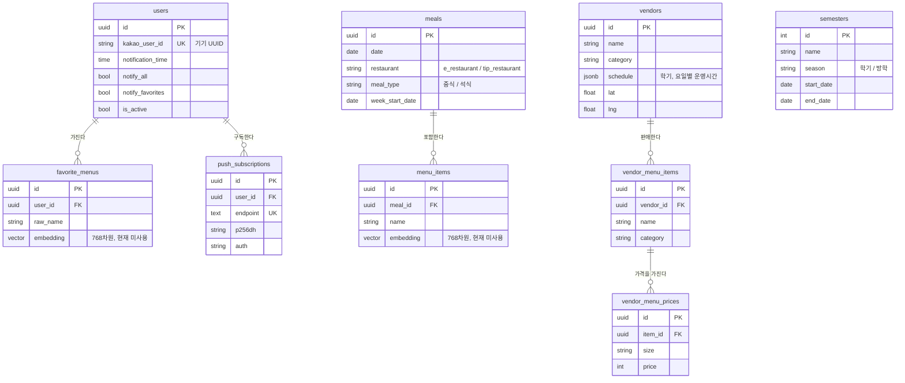

학교 학식표는 iBook 자바스크립트 뷰어가 JPG 이미지로만 제공해서, HTML을 긁어도 텍스트가 나오지 않습니다. 매주 사람이 손으로 옮겨 적지 않으면 데이터가 채워지지 않는 구조였습니다.

**이미지를 자동으로 수집해 AI로 파싱하고, 매일 오전 8시 Web Push로 오늘의 식단을 보내주는 PWA**를 1인으로 만들어 운영 중입니다.

## 개요

| 항목 | 내용 |
|---|---|
| 기간 | 2026.05 ~ 2026.06 (총 60커밋) |
| 역할 | 1인 — 기획 · 백엔드 · 프론트엔드 · 인프라/배포 전 영역 |
| 저장소 | [docodocod/gongdaesik](https://github.com/docodocod/gongdaesik) |
| 서비스 | [gongdaesik.kro.kr](https://gongdaesik.kro.kr) |

**기술 스택**

| 영역 | 사용 기술 |
|---|---|
| Backend | Python, FastAPI 0.115, SQLAlchemy 2.0 async + asyncpg, PostgreSQL, Alembic |
| 수집·AI | Playwright, google-genai (Gemini / Gemini Vision), tenacity |
| 스케줄·알림 | APScheduler, pywebpush (VAPID) |
| Frontend | Next.js 16.2 / React 19, TypeScript, Tailwind CSS v4, next-pwa |
| 인프라·관측 | Docker Compose, nginx(TLS), Prometheus, Grafana, Sentry, GitHub Actions |

## 아키텍처



### 데이터 수집 파이프라인 (매주 월요일 06:00 KST)



## 데이터 모델



`semesters`는 FK 없이 날짜 범위로 조회되어 `vendors.schedule`의 학기/방학 키를 선택하는 데 쓰입니다. Alembic 마이그레이션은 30개입니다.

## 주요 기능

| 기능 | 설명 |
|---|---|
| 오늘/이번 주 학식 조회 | E동·TIP 두 식당 탭, 끼니별 정렬(중식 → 석식) |
| 매일 08:00 Web Push | VAPID 기반 표준 Web Push, 식당별 하루치 식단을 1건으로 묶어 발송 |
| 즐겨찾기 메뉴 알림 | 등록한 키워드가 포함된 끼니만 선별 발송 |
| 교내 식당 13곳 정보 | 요일별·학기/방학별·공휴일·격주 휴무 스케줄을 JSONB로 관리하고 실시간 영업 상태 계산 |
| 메뉴 룰렛 | 교내 식당 메뉴 랜덤 추첨 |
| 로그인 없는 사용자 식별 | `crypto.randomUUID()` 기기 ID를 localStorage + 쿠키에 이중 저장 |
| 카카오 챗봇 연동 | 카카오 i 오픈빌더 웹훅으로 식단 조회 |
| 운영 도구 | 캐시 초기화/현황 API(`X-Admin-Secret` 인증), Prometheus 커스텀 메트릭 4종 |

## 기술적으로 해결한 문제

### 1. 자바스크립트 이미지 뷰어에서 식단 텍스트 추출하기

**문제**

학교 학식 페이지는 iBook 전자책 뷰어라 HTML 소스에 식단 텍스트가 없었습니다. 실제 식단은 JPG 이미지로만 존재해, `requests` + BeautifulSoup으로는 빈 `<div id="viewer">`만 얻었습니다. **매주 사람이 손으로 입력하지 않으면 데이터가 채워지지 않는 구조**였습니다.

**원인 분석**

Playwright로 뷰어에 접속해 네트워크 요청을 관찰한 결과, 식단표가 페이지별 이미지로 지연 로딩되고 이미지 URL은 매주 바뀌는 `bookcode` 변수에 묶여 있었습니다. 또 한 URL 안에 E동·TIP 두 식당 식단이 섞여 들어오는데, **이미지 순서가 항상 같다는 보장이 없었습니다.**

**해결**

브라우저 네트워크 요청을 인터셉트해 이미지 URL을 수집하고, 실패하면 스크린샷으로 폴백하는 2단 전략을 세웠습니다.

```python
# backend/app/services/crawler.py
def on_request(request):
    url = request.url
    if CONTENTS_DOMAIN in url and re.search(r"\.(jpg|jpeg|png|webp)(\?.*)?$", url, re.I):
        if url not in intercepted_image_urls:
            intercepted_image_urls.append(url)

page.on("request", on_request)
await page.goto(viewer_url, wait_until="networkidle", timeout=45000)

if intercepted_image_urls:
    downloaded = await asyncio.gather(*[_download_image(u) for u in intercepted_image_urls])
    images = [b for b in downloaded if b and len(b) >= 10 * 1024]  # 아이콘/썸네일 제외
else:
    images = await _screenshot_all_pages(page)   # 폴백

labels = await asyncio.gather(*[classify_restaurant_from_image(img) for img in images])
```

이미지 순서에 의존하는 대신 **Gemini로 식당을 먼저 분류**하고, 분류 실패 시에만 순서 기반 폴백을 씁니다. 식단 이미지에는 연도가 없고 `5/12(월)` 형태로만 적혀 있어 프롬프트에 기준 날짜를 주입해 연도 추정 오류를 막았습니다.

크롤링과 Gemini 호출 모두 tenacity로 최대 3회 재시도하고, 월요일 07:00·08:00에 "이번 주 식단이 비어 있으면 재크롤링"하는 잡을 별도로 등록했습니다.

**결과**

| 항목 | 개선 전 | 개선 후 |
|---|---|---|
| 식단 데이터 확보 | 수동 입력 필요 (정적 크롤링 불가) | 주 1회 자동 수집 → DB 저장 |
| 수집 실패 대응 | 없음 | 스크린샷 폴백 + tenacity 3회 + 재크롤링 잡 2회 |
| 식당 분류 | 이미지 순서에 의존 | Gemini 분류 + 순서 기반 폴백 |

### 2. 로그는 "발송 성공"인데 폰에 알림이 오지 않던 문제

**문제**

서버 로그에 `Push 발송 성공`이 찍히고 Prometheus `push_sent_total{status="success"}`도 증가하는데, **실제 단말에는 알림이 도착하지 않았습니다.** 실패가 어느 레이어에서 일어나는지 계측으로 드러나지 않는 상태였습니다.

**원인 분석**

세 가지가 겹쳐 있었습니다.

1. **메트릭 자체가 거짓이었습니다.** `send_push()`는 `True | "gone" | False`를 반환하는데 성공 판정이 `r is None`이라 모든 결과가 success로 집계되고 있었습니다.
2. 클라우드 VM의 pause/resume으로 Docker 컨테이너 시계가 드리프트했고, APScheduler가 컨테이너 시계를 기준으로 동작해 의도한 08:00이 아닌 **한밤중에 발송**되고 있었습니다.
3. 한밤중 발송이라 단말이 Android Deep Doze 상태였고, Web Push 기본값인 `Urgency: normal` 메시지는 이 상태에서 지연·드롭될 수 있었습니다.

**해결**

세 지점을 각각 고쳤습니다.

```python
# push_service.py — Deep Doze 상태에서도 즉시 배달
webpush(
    subscription_info={"endpoint": endpoint, "keys": {"p256dh": p256dh, "auth": auth}},
    data=payload,
    vapid_private_key=settings.VAPID_PRIVATE_KEY,
    vapid_claims=_get_vapid_claims(),
    headers={"Urgency": "high"},
)
```

```yaml
# docker-compose.yml — 호스트 시계를 컨테이너에 마운트
    volumes:
      - /etc/localtime:/etc/localtime:ro
```

```python
# notification_service.py — 성공 판정을 3분기로 정정
if r == GONE:      push_sent_total.labels(status="gone").inc()
elif r is True:    push_sent_total.labels(status="success").inc()
else:              push_sent_total.labels(status="error").inc()
```

**결과**

| 항목 | 개선 전 | 개선 후 |
|---|---|---|
| Push 우선순위 | `Urgency: normal` (기본값) | `Urgency: high` 명시 |
| 컨테이너 시각 | VM pause/resume 시 드리프트 | `/etc/localtime` 마운트로 호스트 시계 사용 |
| 성공 메트릭 | `r is None` 판정 → 실패도 success로 집계 | `True` / `gone` / `error` 3분기 |

### 3. 조회 지연과 반복 DB 부하 — 3계층 캐시

**문제**

식단 조회 시 약 0.5초의 로딩 딜레이가 있었습니다. 식단은 주 단위로만 바뀌는데, 메인 화면에 진입할 때마다 today·week 두 API가 매번 DB를 조회하고 있었습니다.

**원인 분석**

데이터 변경 주기(주 1회 크롤링)와 조회 주기(매 진입)가 극단적으로 불일치했습니다. 반대로 캐시를 무조건 붙이면, **월요일 크롤링 전에 접속한 사용자의 "빈 식단"이 캐시에 굳어** 크롤링이 성공해도 만료 전까지 빈 화면이 나가는 문제가 생깁니다.

**해결**

서버 인메모리 TTL 캐시 + 프론트 localStorage SWR + HTTP `Cache-Control` 3계층으로 나누고, 데이터 성격에 맞춰 TTL을 달리했습니다. 오늘 식단은 KST 자정까지만 캐시해 날짜가 바뀌면 자동 만료되게 하고, **빈 결과는 캐시하지 않는** 조건을 걸었습니다.

```python
# backend/app/api/meals.py
cached = cache.get(cache_key)
if cached is not None:
    return JSONResponse(content=cached, headers={"Cache-Control": "public, max-age=300"})

meals = await meal_service.get_meals_by_date(db, today_kst(), restaurant=r)
payload = MealListResponse(...).model_dump(mode="json")
# 빈 식단은 캐싱하지 않음 (크롤링 전 접속의 빈 결과가 굳는 것 방지)
if meals:
    cache.set(cache_key, payload, cache.seconds_until_midnight_kst())
```

```typescript
// frontend/lib/cache.ts — 캐시가 있으면 즉시 렌더 후 백그라운드 재검증
if (cached) {
  onData(cached.data, false);
  fetcher().then((data) => { write(key, data); onData(data, true); });
  return;
}
```

함께 조회 경로의 인덱스와 커넥션 풀도 손봤습니다 — `meals(date, restaurant)`, `meals(week_start_date, restaurant)`, `users(notification_time)`, `semesters(start_date, end_date)` 인덱스 추가, 커넥션 풀 `pool_size 10 → 20` / `max_overflow 20`.

**결과**

| 항목 | 개선 전 | 개선 후 |
|---|---|---|
| 재방문 시 식단 로딩 | 약 0.5초 딜레이 | localStorage 캐시 즉시 렌더 후 백그라운드 재검증 |
| 동일 요청의 DB 조회 | 매 요청 | 캐시 히트 시 0회 (today: 자정까지 / week·vendors: 1시간) |
| 크롤링 전 빈 결과 | 자정까지 캐시에 고정 | 빈 배열 미캐싱 + 크롤링 후 프리픽스 무효화 |
| DB 커넥션 | pool_size 10 | pool_size 20 + overflow 20 |

### 4. 구독자 수에 비례해 늘어나는 알림 발송 시간

**문제**

알림 발송이 구독 하나씩 순차로 이뤄졌고, `pywebpush`는 동기 HTTP 라이브러리라 발송 중 **이벤트 루프가 통째로 블로킹**됐습니다. 구독자가 늘수록 전체 발송 시간이 선형으로 늘고, 그 시간 동안 API 응답도 함께 느려지는 구조였습니다.

**원인 분석**

병목은 CPU가 아니라 FCM/APNs 왕복 대기였습니다. 그렇다고 전부 동시에 던지면 외부 푸시 서버에 부담이 가므로, **동시성 상한을 둔 병렬화**가 필요했습니다. 또 앱 삭제·권한 취소로 만료된 구독(410 Gone)이 DB에 남아 매일 실패 요청을 반복하고 있었는데, `pywebpush`가 410을 전달하는 방식이 일반적이지 않아 만료 감지 조건이 헐려 있었습니다.

**해결**

동기 발송을 `asyncio.to_thread`로 감싸 루프 블로킹을 없애고, `Semaphore(20)`으로 동시 발송 수를 제한한 채 `asyncio.gather`로 병렬화했습니다. 발송 결과에서 410을 모아 한 번의 쿼리로 일괄 삭제합니다.

```python
# notification_service.py
_PUSH_CONCURRENCY = 20
sem = asyncio.Semaphore(_PUSH_CONCURRENCY)

async def _bounded(sub):
    async with sem:
        return await _notify_subscription(sub, today, today_meals)

results = await asyncio.gather(*[_bounded(sub) for sub in subscriptions])
gone_endpoints = [ep for endpoints in results if endpoints for ep in endpoints]
if gone_endpoints:
    await _delete_gone_subscriptions(db, gone_endpoints)   # DELETE ... WHERE endpoint IN (...)
```

```python
# push_service.py — e.response 가 None 인 경우까지 커버
status = e.response.status_code if e.response else "N/A"
is_gone = status == 410 or "410" in str(e)
```

**결과**

| 항목 | 개선 전 | 개선 후 |
|---|---|---|
| 발송 방식 | 구독별 순차, 동기 호출로 이벤트 루프 블로킹 | `to_thread` + `Semaphore(20)` 병렬 |
| 발송 시간 (구독 100건) | 100초 | **2초** |
| 만료 구독 | 410 미감지로 DB 잔존, 매일 실패 요청 반복 | 발송 결과에서 수집해 일괄 DELETE |

### 5. 서버가 UTC라서 아침에 "어제 식단"이 보이던 버그

**문제**

배포 후, 오전에 앱을 열면 오늘이 아닌 전날 식단이 표시됐습니다. 로컬(KST) 개발 환경에서는 재현되지 않았습니다.

**원인 분석**

서버 컨테이너가 UTC로 동작하고 `date.today()`가 UTC 기준 날짜를 반환했습니다. KST는 UTC+9이므로 **KST 09:00 이전에는 UTC 기준으로 아직 전날**이고, 사용자가 아침에 접속하는 시간대가 정확히 그 구간이었습니다. 알림 스케줄러도 같은 기준을 쓰고 있어 발송 대상 날짜가 함께 어긋났습니다.

**해결**

서버 로컬 타임존과 무관하게 KST 날짜를 반환하는 헬퍼를 만들고, 날짜를 다루는 호출부를 전부 교체했습니다. APScheduler는 `timezone="Asia/Seoul"`로 고정하고, 캐시 TTL도 KST 자정 기준으로 계산합니다.

```python
# backend/app/utils.py
_KST = ZoneInfo("Asia/Seoul")

def today_kst() -> date:
    """서버 로컬 타임존과 무관하게 KST 기준 오늘 날짜를 반환한다."""
    return datetime.now(_KST).date()
```

**결과**

| 항목 | 개선 전 | 개선 후 |
|---|---|---|
| 오전 조회 결과 | KST 00:00~09:00 구간에 전날 식단 반환 | 항상 KST 기준 당일 식단 |
| 기준 시각 | `date.today()` (서버 로컬 = UTC) | `today_kst()` + `AsyncIOScheduler(timezone="Asia/Seoul")` |
| 캐시 만료 경계 | UTC 자정 | KST 자정 |

## 담당 범위

기획부터 운영까지 1인으로 진행했습니다.

| 영역 | 내용 |
|---|---|
| 백엔드 | 라우터/서비스/모델 레이어 분리 설계, Alembic 마이그레이션 30개, 크롤링·AI 파싱 파이프라인, Web Push 발송 로직, TTL 캐시, slowapi 레이트리밋(IP + device_id 이중 키) |
| 프론트엔드 | Next.js App Router 5개 페이지, localStorage 기반 SWR 캐시 직접 구현, PWA 서비스워커 푸시 핸들러, 스와이프 내비게이션, 다크 모드, 영업 상태 계산 로직 |
| 인프라·운영 | Docker Compose(API·PostgreSQL·Prometheus·Grafana), nginx 리버스 프록시 + Let's Encrypt TLS, GitHub Actions push-to-deploy, Prometheus 커스텀 메트릭 4종과 Grafana 대시보드, Sentry 연동 |
| 데이터 | 교내 식당 13곳의 메뉴·가격·영업시간을 직접 수집해 시드 마이그레이션으로 반영 |

## 배운 점

**로그의 성공이 실제 성공은 아니다.** 푸시 미수신 문제에서는 성공 메트릭의 판정 조건 자체가 틀려 있었습니다. 계측 코드도 검증 대상이라는 걸, 지표를 믿고 원인을 헤매고 나서 배웠습니다.

**타임존은 처음에 결정해야 하는 문제다.** 로컬에서 재현되지 않던 버그의 원인이 실행 환경의 타임존이었고, 이후 날짜를 쓰는 지점을 전부 `today_kst()`로 통일했습니다.

**캐시는 TTL보다 무효화 조건이 어렵다.** "빈 결과는 캐시하지 않는다"는 한 줄이 있어야 아침의 빈 화면 버그를 막을 수 있었습니다. 캐시를 붙일 때 히트율보다 **잘못된 값이 굳는 경우**를 먼저 따지게 됐습니다.

**AI를 쓰는 것과 신뢰할 수 있게 쓰는 것은 다르다.** Gemini Vision 파싱에 기준 날짜 주입, 출력 스키마 고정, 재시도, 분류 실패 폴백, 결과 0건 시 재크롤링까지 붙이고 나서야 무인 운영이 가능해졌습니다.

**도입한 기술과 실제로 쓰는 기술은 구분해야 한다.** pgvector로 즐겨찾기 유사도 매칭을 시도했지만 한글 임베딩 품질이 기대에 못 미쳐("고기볶음"과 "회무침"이 90% 이상 유사) 문자열 비교로 되돌렸습니다. 스키마에 컬럼이 남아 있고, 이를 "미사용"이라고 정직하게 말할 수 있는 것도 결과라고 생각합니다.
