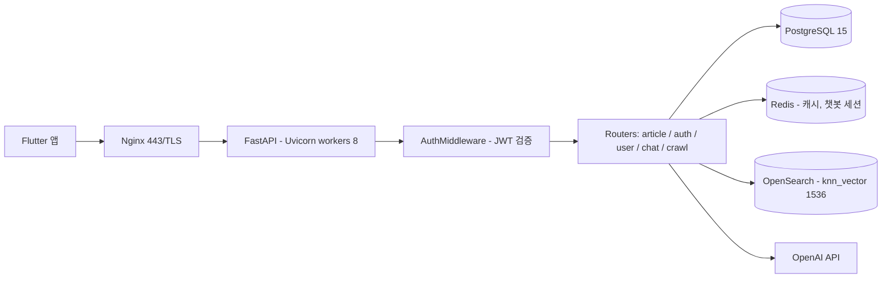
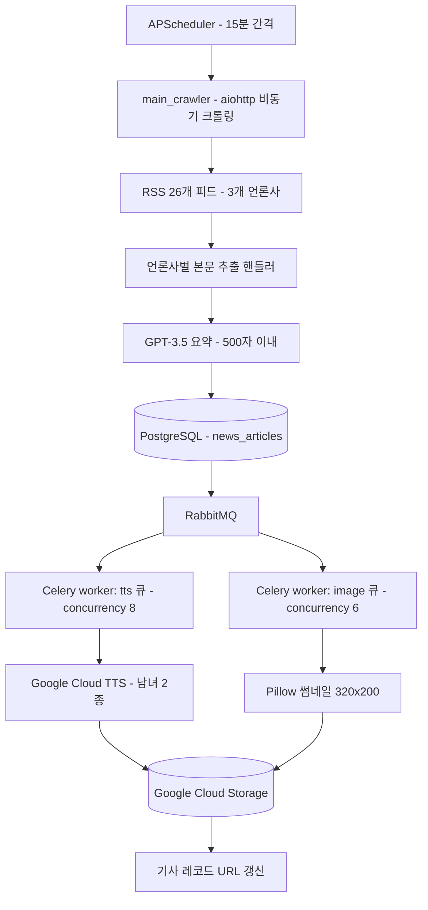
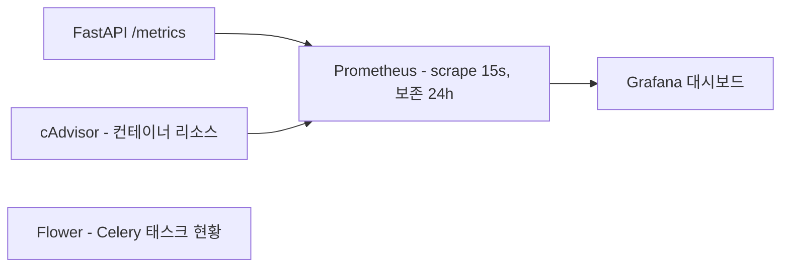
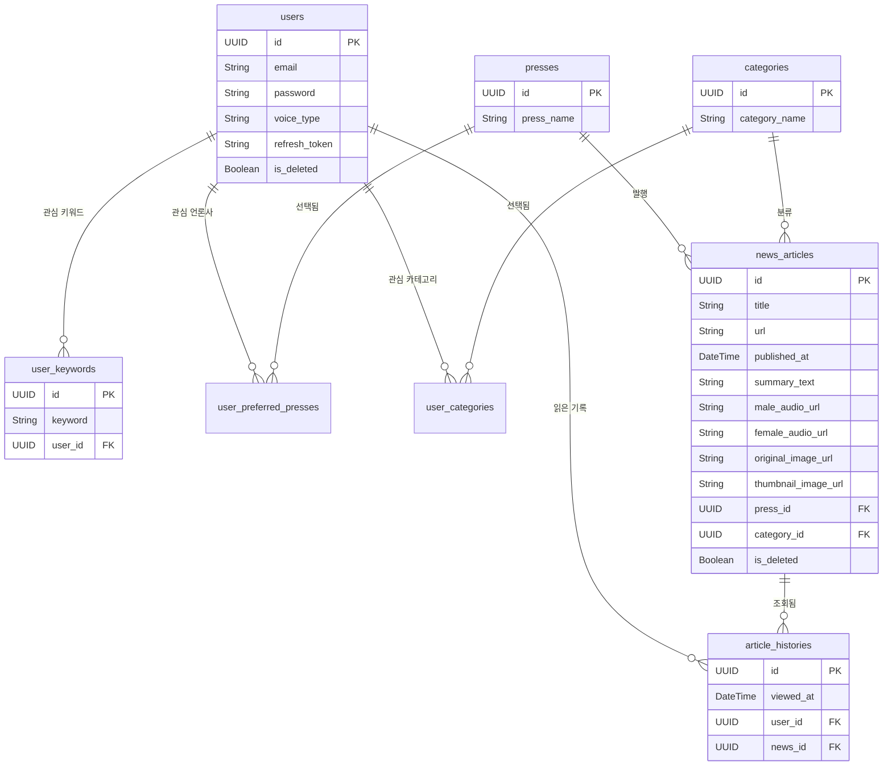

Techeer Silicon Valley SW Bootcamp에서 **팀장 겸 백엔드·DevOps**로 개발한 AI 뉴스 브리핑 서비스입니다.

3개 언론사의 RSS 26개 피드를 15분마다 크롤링해 GPT로 요약하고, TTS 음성과 썸네일을 백그라운드로 생성한 뒤, 사용자 관심 키워드에서 벡터 유사도로 기사를 추천합니다.

## 개요

| 항목 | 내용 |
|---|---|
| 기간 | 2025.07 ~ 2025.08 |
| 역할 | 팀장 / 백엔드 / DevOps |
| 팀 구성 | 5명 — 백엔드·DevOps 1, 풀스택·DevOps 2, 프론트엔드·디자인 2 |
| 저장소 | [2025-Summer-Techeer-Bootcamp-Team-B/backend](https://github.com/2025-Summer-Techeer-Bootcamp-Team-B/backend) |

**기술 스택**

| 영역 | 사용 기술 |
|---|---|
| Web | FastAPI 0.116, Uvicorn, Starlette |
| DB | PostgreSQL 15, SQLAlchemy 2.0 |
| 비동기 | Celery 5.3, RabbitMQ 3, Redis 5.0, Flower |
| AI | OpenAI (gpt-3.5-turbo, text-embedding-ada-002), LangChain |
| 검색 | OpenSearch 2.11 (k-NN) |
| 외부 | Google Cloud Text-to-Speech, Cloud Storage |
| 크롤링 | aiohttp, BeautifulSoup4, APScheduler |
| 인증 | python-jose (HS256), bcrypt, passlib |
| 인프라 | Docker Compose, Nginx, Certbot, GCP VM |
| 모니터링 | Prometheus, Grafana, cAdvisor |

## 아키텍처

### 요청 처리 경로



### 수집·후처리 파이프라인



### 모니터링



## 데이터 모델

모든 테이블이 UUID PK와 `created_at` / `updated_at` / `is_deleted`(Soft Delete) 공통 컬럼을 가집니다.



## 주요 기능

- **뉴스 자동 수집·요약** — APScheduler가 15분마다 3개 언론사 26개 RSS 피드를 aiohttp로 병렬 크롤링(동시 실행 10개 제한)하고, 언론사별 핸들러로 본문을 추출한 뒤 gpt-3.5-turbo로 500자 이내 요약합니다.
- **TTS 음성 브리핑** — Google Cloud TTS `ko-KR-Chirp3-HD` 남성/여성 2종을 `asyncio.gather`로 동시 생성해 GCS에 업로드합니다.
- **썸네일 생성** — 원본 이미지를 Pillow로 320×200 리사이즈·JPEG 품질 85로 변환합니다. 원본이 없거나 다운로드에 실패하면 fallback 이미지로 대체합니다.
- **키워드 기반 추천** — 사용자 키워드를 ada-002로 1536차원 임베딩한 뒤 OpenSearch k-NN으로 검색해, 유사도 0.75 이상만 최대 30건 반환합니다.
- **기사 챗봇** — LangChain `ChatOpenAI`로 기사 컨텍스트를 시스템 프롬프트에 주입하고, 대화 히스토리를 Redis에 30분 TTL로 유지합니다.
- **CI/CD** — main 브랜치 push 시 GitHub Actions가 Docker 이미지를 빌드·푸시하고 GCP VM에 SSH로 접속해 `docker compose`를 재기동합니다.

## 기술적으로 해결한 문제

### 1. 추천 인덱싱에서 기사 수만큼 발생하는 외부 API 호출

**문제**

초기 추천 로직은 DB의 전체 기사를 대상으로, 기사 1건마다 임베딩 API를 1회 그리고 OpenSearch 인덱싱을 1회씩 호출했습니다. 인덱싱 대상이 `is_deleted=False`인 전체 기사여서 기사가 쌓일수록 호출 횟수가 선형으로 늘어나는 구조였습니다.

```python
# 개선 전: app/services/recommend_service.py
async def index_article(article_id, title, content):
    embedding = await get_embedding_async(f"{title} {content}")   # 기사 1건 = API 1회
    doc = {"title": title, "content": content, "embedding": embedding}
    client_os.index(index="news-articles", id=article_id, body=doc)  # 동기 클라이언트

async def index_all_articles(db):
    articles = db.query(NewsArticle).filter_by(is_deleted=False).all()  # 전체 기사
    await asyncio.gather(*[index_article(...) for article in articles])
```

**원인 분석**

세 가지가 겹쳐 있었습니다.

1. 임베딩 API를 기사 단위로 호출 — OpenAI 임베딩 API는 `input`에 배열을 받아 배치 처리가 가능한데 이를 쓰지 않았습니다.
2. OpenSearch 인덱싱이 동기 클라이언트(`client_os.index`)라 `asyncio.gather`로 감싸도 실제로는 이벤트 루프를 블로킹했습니다.
3. 추천은 사용자의 관심 언론사·카테고리 안에서만 의미가 있는데 전체 기사를 인덱싱하고 있었습니다.

**해결**

배치 임베딩 + OpenSearch `_bulk` API + 인덱싱 범위 축소를 함께 적용했습니다.

```python
# 개선 후: app/services/recommend/opensearch.py
async def bulk_index_articles(articles: List[NewsArticle]):
    texts = [f"{a.title} {a.summary_text}" for a in articles]
    embeddings = await get_embeddings_batch_async(texts)  # 전체를 한 번에

    bulk_lines = []
    for article_id, title, content, embedding in zip(article_ids, titles, contents, embeddings):
        bulk_lines.append(json.dumps({"index": {"_index": "news-articles", "_id": article_id}}))
        bulk_lines.append(json.dumps({"title": title, "content": content, "embedding": embedding}))

    async with aiohttp.ClientSession() as session:      # 동기 클라이언트 → aiohttp
        async with session.post("http://opensearch:9200/_bulk",
                                data="\n".join(bulk_lines) + "\n",
                                headers={"Content-Type": "application/x-ndjson"}) as resp:
            return await resp.json()
```

인덱싱 대상도 사용자의 선호 언론사 ∩ 관심 카테고리 ∩ 당일 기사로 좁혔습니다.

**결과**

| 항목 | 개선 전 | 개선 후 |
|---|---|---|
| 기사 N건 인덱싱 시 임베딩 API 호출 | N회 | **1회** |
| 기사 N건 인덱싱 시 OpenSearch 요청 | N회 (동기, 루프 블로킹) | **1회** (`_bulk`, 비동기) |
| 인덱싱 대상 | `is_deleted=False`인 전체 기사 | 사용자 선호 언론사·카테고리의 당일 기사 |
| k-NN 검색 클라이언트 | 동기 `opensearch-py` | 비동기 `aiohttp` |

### 2. 단일 Celery 워커에서 성격이 다른 후처리가 서로를 막던 문제

**문제**

초기에는 Celery 워커 컨테이너 하나가 모든 태스크를 처리했습니다. 기사 저장 직후 실행되는 후처리는 성격이 서로 다릅니다 — TTS 생성은 Google Cloud API 응답을 기다리는 **I/O 대기** 작업이고, 썸네일 생성은 Pillow로 이미지를 디코딩·리사이즈·인코딩하는 **CPU 작업**입니다. 한 종류가 몰리면 그쪽이 워커 슬롯을 점유하는 동안 다른 쪽 태스크가 밀립니다.

**원인 분석**

크롤링 1사이클에서 기사가 저장될 때마다 TTS 태스크와 이미지 태스크가 **각각** 발행됩니다. 26개 피드 × 3건 = 최대 78건 기준으로 한 사이클에 최대 156개 태스크가 하나의 큐로 몰리는 구조였고, 워커가 하나뿐이라 어떤 작업이 먼저 처리될지 제어할 방법이 없었습니다. 실패 격리도 되지 않아 이미지 처리에서 예외가 반복되면 TTS까지 영향을 받았습니다.

**해결**

Kombu `Queue`로 큐를 분리하고, 태스크에 큐를 고정한 뒤 워커 컨테이너를 큐별로 나눠 concurrency를 다르게 부여했습니다.

```python
# app/celery_app.py
celery_app.conf.task_queues = (Queue("tts"), Queue("image"), Queue("default"))

@celery_app.task(queue='tts')
def generate_tts_audio_async(article_id: str) -> Dict: ...

@celery_app.task(queue='image')
def process_image_async(article_id: str) -> Dict: ...
```

```yaml
# docker-compose.yml
celery-worker-tts:
  command: celery -A app.celery_app worker -Q tts   -n tts@%h   --concurrency=8
celery-worker-image:
  command: celery -A app.celery_app worker -Q image -n image@%h --concurrency=6
```

**결과**

| 항목 | 개선 전 | 개선 후 |
|---|---|---|
| 워커 컨테이너 | 1개 (전체 큐 담당) | 2개 (`tts`, `image`) |
| 큐 | 기본 큐 1개 | `tts` / `image` / `default` |
| concurrency | 8 (공통) | TTS 8 (I/O 위주), 이미지 6 (CPU 위주) |
| 장애 격리 | 없음 | 워커 프로세스 분리로 한쪽 장애가 다른 큐에 전파되지 않음 |
| 관측 | — | Flower로 큐별 태스크 현황 확인 |

### 3. 후처리가 끝나지 않은 기사가 API로 노출되던 문제

**문제**

기사는 DB에 저장되는 순간 `male_audio_url`, `female_audio_url`, `thumbnail_image_url`이 모두 빈 문자열입니다. 실제 값은 Celery 워커가 TTS와 썸네일을 만든 다음에야 채워집니다.

```python
# app/core/save.py — 저장 시점에는 URL이 비어 있음
news_article = NewsArticle(male_audio_url="", female_audio_url="", thumbnail_image_url="", ...)
db.add(news_article); db.commit()
generate_tts_audio_async_task(str(news_article.id))   # 이후 워커가 채움
process_image_to_gcs_async_task(str(news_article.id))
```

`/articles/recent`는 `published_at DESC` 정렬이라 **가장 최근 기사 = 후처리가 아직 끝나지 않은 기사**가 됩니다. 그 결과 앱 첫 화면에 이미지가 깨지고 재생이 되지 않는 기사가 그대로 올라왔습니다.

**원인 분석**

쓰기 경로(크롤러 → DB → Celery)와 읽기 경로(API → DB)가 분리된 최종적 일관성 구조인데, 읽기 쪽에 "후처리 완료" 조건이 없다는 것이 원인이었습니다. 워커 완료를 동기적으로 기다리면 비동기로 분리한 의미가 사라지므로, 별도 상태 컬럼 없이 완료 여부를 판별할 방법이 필요했습니다. **후처리의 산출물인 URL 컬럼 자체가 완료 플래그 역할을 할 수 있다**는 점을 이용했습니다.

**해결**

조회 쿼리에 후처리 산출물 3종이 채워졌는지를 조건으로 넣었습니다.

```python
# app/core/query.py
def get_article_recent(db: Session, limit: int = 20) -> List[NewsArticle]:
    return db.query(NewsArticle).filter(
        NewsArticle.is_deleted == False,
        NewsArticle.male_audio_url.isnot(None),      NewsArticle.male_audio_url != '',
        NewsArticle.female_audio_url.isnot(None),    NewsArticle.female_audio_url != '',
        NewsArticle.thumbnail_image_url.isnot(None), NewsArticle.thumbnail_image_url != '',
    ).order_by(NewsArticle.published_at.desc()).limit(limit).all()
```

썸네일이 필터링 대상이 되면 원본 이미지가 없는 기사가 아예 노출되지 않으므로, 워커에서 원본 URL이 없거나 다운로드에 실패하면 GCS의 fallback 이미지 URL을 채우도록 보완했습니다.

**결과**

| 항목 | 개선 전 | 개선 후 |
|---|---|---|
| `/articles/recent` 반환 조건 | `is_deleted == False` | + 음성 2종·썸네일 URL이 모두 채워진 기사만 |
| `/articles/{id}` 반환 조건 | `id` 일치만 (`is_deleted` 검사 없음) | + `is_deleted` 및 후처리 완료 조건 |
| 원본 이미지 없는 기사 | 썸네일이 없어 영구 제외 | fallback 이미지를 채워 정상 노출 |

### 4. 전역 JWT 미들웨어가 CORS Preflight를 401로 막던 문제

**문제**

인증을 라우터별 `Depends`가 아닌 전역 `BaseHTTPMiddleware`로 처리하는 구조였는데, 브라우저(Flutter Web)에서 호출하면 실제 요청 전에 나가는 `OPTIONS` preflight 요청이 미들웨어에 걸렸습니다. preflight에는 `Authorization` 헤더가 실리지 않으므로 미들웨어가 401을 반환했고, 브라우저는 본 요청을 아예 보내지 않아 보호된 API가 모두 CORS 오류로 실패했습니다.

**원인 분석**

`app.add_middleware()`로 등록한 미들웨어는 나중에 등록한 것이 바깥쪽에 쌓입니다. `AuthMiddleware`가 `CORSMiddleware`보다 뒤에 등록되어, preflight가 CORS 처리에 닿기 전에 인증 검사를 먼저 통과해야 했습니다. 또한 `allow_origins=["*"]`와 `allow_credentials=True`는 함께 쓸 수 없어, 자격 증명이 포함된 요청에서 CORS 헤더가 무시되는 문제도 있었습니다.

**해결**

미들웨어 최상단에서 `OPTIONS`를 인증 없이 통과시키고, 와일드카드 대신 허용 오리진을 명시했습니다. 인증이 필요 없는 경로는 화이트리스트로 한곳에서 관리하고, refresh 토큰 전용 경로는 토큰 `type`까지 구분해 검증합니다.

```python
# app/middleware/auth_middleware.py
async def dispatch(self, request: Request, call_next):
    if request.method == "OPTIONS":          # preflight 는 인증 없이 통과
        return await call_next(request)
    if is_public_path:
        return await call_next(request)
    payload = verify_token(token)
    if is_refresh_only_path and payload.get("type") != "refresh":
        return JSONResponse(content='{"detail": "Invalid token type"}', status_code=401)
```

**결과**

| 항목 | 개선 전 | 개선 후 |
|---|---|---|
| `OPTIONS` preflight | 401 (Authorization 헤더 없음) | 인증 검사 없이 통과 |
| `allow_origins` | `["*"]` (`allow_credentials=True`와 충돌) | 개발·배포 오리진 4개 명시 |
| 토큰 타입 검증 | 서명·만료만 검증 | `access` / `refresh` 타입을 경로별로 구분 검증 |

### 5. 매 요청마다 반복되는 조회·임베딩 비용을 캐싱

**문제**

성격이 다른 세 종류의 반복 비용이 있었습니다.

1. 실시간 뉴스 목록은 크롤링 주기가 15분인데도 사용자가 진입할 때마다 DB를 조회
2. 관심 언론사·카테고리·키워드 설정은 거의 바뀌지 않는데 화면마다 조회 쿼리가 나감
3. 추천 API는 호출할 때마다 사용자 키워드를 OpenAI 임베딩 API로 다시 변환 — 외부 호출이라 비용과 지연이 직접 발생

**원인 분석**

세 데이터의 변경 주기가 서로 달랐습니다. 기사 목록은 15분마다 갱신되지만 조회는 그보다 훨씬 잦고, 사용자 설정은 사용자가 직접 수정할 때만 바뀌며, 키워드 임베딩은 같은 입력에 항상 같은 결과가 나오는 순수 함수입니다. 하나의 TTL로 묶을 수 없어 계층별로 다른 TTL과 무효화 전략을 두기로 했습니다.

**해결**

Redis에 계층별 캐시를 두고, 사용자 설정만은 TTL이 아니라 **쓰기 시점 무효화**로 정합성을 확보했습니다.

```python
# app/routers/article.py — 실시간 뉴스 60초
cache_key = f"recent_articles:{limit}"
if cached := redis_client.get(cache_key):
    return [ArticleRecentResponse(**{**a, "id": str(a["id"])}) for a in json.loads(cached)]
redis_client.setex(cache_key, 60, json.dumps(articles_data, default=str))
```

```python
# app/services/recommend/redis_cache.py — 키워드 임베딩 24시간
cache_key = f"user:{user_id}:keyword_embedding:{keyword}"
if cached := redis_client.get(cache_key):
    return json.loads(cached)
embedding = await get_embedding_async(keyword)
redis_client.setex(cache_key, 60 * 60 * 24, json.dumps(embedding))
```

**결과**

| 캐시 계층 | 키 | TTL | 무효화 방식 |
|---|---|---|---|
| 실시간 뉴스 목록 | `recent_articles:{limit}` | 60초 | TTL 만료 (크롤링 주기 15분보다 짧게) |
| 사용자 관심 설정 4종 | `user:{id}:preferences:{type}` | 24시간 | 설정 수정 API에서 해당 키 즉시 삭제 |
| 키워드 임베딩 | `user:{id}:keyword_embedding:{kw}` | 24시간 | TTL 만료 (동일 입력 → 동일 결과) |
| 챗봇 대화 히스토리 | `chat_history:{conversation_id}` | 30분 | 대화 갱신 시 `keepttl=True`로 TTL 유지 |

## 담당 범위

5명 팀에서 **팀장 / 백엔드 / DevOps**를 맡았습니다. 전체 171개 커밋 중 91개가 본인 커밋입니다.

| 영역 | 내용 |
|---|---|
| 크롤링 파이프라인 | RSS 수집 → 언론사별 본문 추출 → GPT 요약 → DB 저장 전체 구조, 15분 주기 스케줄러 |
| 데이터 저장 계층 | `save_article_to_db` / `save_articles_batch`, 언론사·카테고리 get-or-create, KST 시간 파싱, URL 기준 중복 제거 |
| 조회 쿼리 계층 | 실시간·카테고리별·상세 조회 쿼리, 후처리 완료 필터, 읽은 기록 |
| Celery 큐 아키텍처 | 단일 워커 → tts/image 큐 분리 및 워커별 concurrency 설계 |
| 추천 인덱싱 최적화 | 배치 임베딩 + `_bulk` 인덱싱 + 사용자 범위 한정 |
| 캐싱 계층 | 실시간 뉴스 캐시, 사용자 설정 캐시 클래스 설계 |
| 인증 / CORS | JWT 미들웨어 preflight 처리, 오리진 화이트리스트, 토큰 타입 검증 |
| DevOps | GitHub Actions CI/CD, GCP VM 배포, Nginx 리버스 프록시, Let's Encrypt HTTPS |
| 구조 리팩터링 | `services/`를 도메인별(crawling / recommend / tts / thumbnails / users / auth)로 재편, `core` 계층 분리 |

인증 모듈 초기 구현, Celery·RabbitMQ 도커 환경 초기 구성, 추천 API 최종 정리와 유사도 임계값 튜닝, 모니터링 대시보드 구성, Flutter 프론트엔드와 디자인은 다른 팀원이 담당했습니다.

## 배운 점

**비동기로 옮기면 일관성 문제가 따라온다.** TTS·썸네일을 Celery로 분리한 순간 "저장은 됐지만 아직 완성되지 않은 기사"라는 중간 상태가 생겼습니다. 쓰기 성능을 위해 작업을 뒤로 미루면 읽기 쪽에서 그 중간 상태를 어떻게 다룰지 반드시 함께 설계해야 한다는 것을 배웠습니다. 이 프로젝트에서는 후처리 산출물 컬럼 자체를 완료 플래그로 쓰는 방식으로 풀었지만, 상태 컬럼(`processing` / `done` / `failed`)을 명시적으로 두는 편이 실패 케이스 추적에는 더 나았을 것이라고 생각합니다.

**"비동기 함수로 감쌌다"와 "실제로 병렬이다"는 다르다.** 개선 전 추천 인덱싱은 `asyncio.gather`로 감싸져 있었지만 내부의 OpenSearch 클라이언트가 동기라 이벤트 루프를 블로킹하고 있었습니다. 코드의 모양이 비동기인 것과 실제로 대기 시간이 겹치는 것은 별개이며, 쓰는 라이브러리가 정말 논블로킹인지 확인해야 한다는 점을 알게 됐습니다.

**외부 API는 호출 단위를 먼저 본다.** 임베딩 API가 배열 입력을 지원한다는 사실 하나로 N번 호출이 1번으로 줄었습니다. 최적화에 들어가기 전에 그 API가 배치를 지원하는지부터 확인하는 습관이 생겼습니다.

**큐 분리는 성능보다 격리를 위한 것이었다.** 처음에는 처리량 때문에 큐를 나눈다고 생각했지만, 실제로 얻은 가장 큰 이득은 이미지 처리가 실패해도 TTS는 계속 동작한다는 장애 격리와, 병목이 어느 쪽인지 Flower로 바로 구분할 수 있게 된 관측 가능성이었습니다.

**측정하지 않으면 개선을 말할 수 없다.** Prometheus·Grafana·cAdvisor를 붙여 놓고도 개선 전후를 비교하는 부하 테스트를 남기지 않아, 이 페이지의 개선 효과를 호출 횟수 같은 정적 지표로만 설명할 수 있었습니다. 다음 프로젝트에서는 개선에 착수하기 전에 기준선부터 측정해 두려고 합니다.
